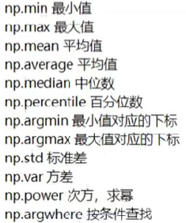
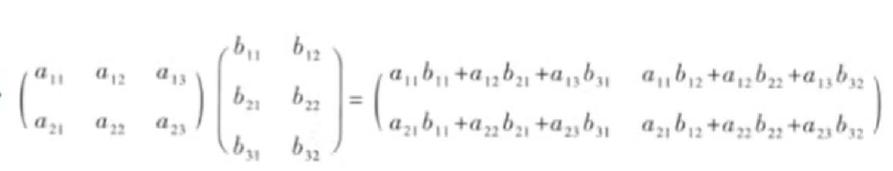

<a id="mulu">目录</a>
<a href="#mulu" class="back">回到目录</a>
<style>
    .back{width:40px;height:40px;display:inline-block;line-height:20px;font-size:20px;background-color:lightyellow;position: fixed;bottom:50px;right:50px;z-index:999;border:2px solid pink;opacity:0.3;transition:all 0.3s;color:green;}
    .back:hover{color:red;opacity:1}
    img{vertical-align:bottom;}
</style>

<!-- @import "[TOC]" {cmd="toc" depthFrom=3 depthTo=6 orderedList=false} -->

<!-- code_chunk_output -->

- [numpy基础](#numpy基础)
    - [数据类型](#数据类型)
- [ndarray数组](#ndarray数组)
    - [创建](#创建)
      - [列表直接创建](#列表直接创建)
      - [使用np函数创建](#使用np函数创建)
    - [常用属性](#常用属性)
    - [常用操作](#常用操作)
      - [索引](#索引)
      - [切片](#切片)
      - [应用：翻转](#应用翻转)
      - [增加](#增加)
      - [删改](#删改)
      - [变形](#变形)
      - [级联（合并）](#级联合并)
      - [分隔](#分隔)
      - [复制](#复制)
    - [聚合操作](#聚合操作)
- [矩阵操作](#矩阵操作)
    - [基本操作](#基本操作)
      - [加减乘除](#加减乘除)
      - [线性代数](#线性代数)
    - [广播机制](#广播机制)
    - [其它常见数学操作](#其它常见数学操作)
    - [排序](#排序)
- [文件操作](#文件操作)
    - [保存/读取数组](#保存读取数组)
    - [读写csv/txt文件](#读写csvtxt文件)
- [练习题](#练习题)

<!-- /code_chunk_output -->

<!-- 打开侧边预览：f1->Markdown Preview Enhanced: open...
只有打开侧边预览时保存才自动更新目录 -->

写在前面：本笔记来自b站课程[千锋教育python数据分析教程200集](https://www.bilibili.com/video/BV15V4y1f7Ju)
[资料下载](https://pan.baidu.com/s/1yrr-kvH2PAR7zNI3K81WSA)  提取码：wusa

```py
import numpy as np
```

### numpy基础
##### 数据类型
数组中常见的数据类型：
- int--int8 uint8 int16 int32 int64
- float--float16 float32 float64
- str字符串

如果需要将数据类型传入函数，就使用`np.int8`这种形式表示
### ndarray数组
##### 创建
###### 列表直接创建
`np.array(列表)`
```py
lst = [1,2,3,4,5]
nd = np.array(lst)
print(nd) #[1 2 3 4 5]
print(type(nd)) #<class 'numpy.ndarray'>
```
注意：因为numpy默认ndarray中所有元素类型相同，如果传入的列表中有不同类型，则会**自动转换为同一类型**，优先级`str>float>int`
```py
print(np.array([3.1,2,"string"])) #['3.1' '2' 'string']
print(np.array([3.1,3])) #[3.1 3. ]
```
###### 使用np函数创建
- `np.ones(shape,dtype=None,order='C')`创建一个所有元素都为1的多维数组。
  `shape=(m,[n,...])`控制创建m行n列的多维数组；`dtype`接收数据类型（可以是numpy的，也可以是python自带的int等）；`order`控制内存存储方式。一般只给第一个参数即可
  ```py
  n = np.ones(shape=(3,)) #创建有3个元素的一维数组
  print(n) #[1. 1. 1.] 默认使用浮点数
  n = np.ones(shape=(3,4),dtype=np.int8) #创建3行4列的二维数组，指定int类型
  print(n) #[[1 1 1 1],[1 1 1 1],[1 1 1 1]]
  #还可以有更高维，如shape=(3,4,5)
  ```
- `np.zeros(shape,dtype=None,order='C')`创建一个所有元素都为0的多维数组。使用方式同上
- `np.full(shape,fill_value,dtype=None,order='C')`创建一个所有元素都为`fill_value`的多维数组。使用方式同上
- `np.eye(row,col,k=0,dtype=None,order='C')`创建row行col列的、主对角线（左上-右下）位置为1 其它位置为0的二维数组。其中col默认=row；k指定向右偏移k个位置，若为负数就是向左偏移
  `np.eye(3,3,dtype=np.int8)`
  ```
  [[1 0 0]
  [0 1 0]
  [0 0 1]]
  ```
  `np.eye(3,5,k=2,dtype=np.int8)`
  ```
  [[0 0 1 0 0]
  [0 0 0 1 0]
  [0 0 0 0 1]]
  ```
- `np.linspace(start,stop,num=50,endpoint=True,retstep=False,dtype=None)`创建从start到stop的等差数列，该数列有num个数，步长根据这3个值自动进行计算；endpoint控制该数列是否包含结束值stop；retstep决定是否返回步长
  ```py
  n = np.linspace(0,10,num=6,dtype=np.int16) #默认包含结束值
  print(n) #[ 0  2  4  6  8  10]
  n = np.linspace(0,10,num=5,dtype=np.int16,endpoint=False,retstep=True) #设置不包含结束值
  print(n) #(array([0, 2, 4, 6, 8], dtype=int16), 2.0) 可以看到结果中包含步长
  ```
- `np.arrange(start=0,stop,step=1,dtype=None)`创建`[start,stop)`的步长为`step`的数组，类似于python中的`range()`。注意它**不包含结束值**
  ```py
  n1 = np.arange(10) #[0 1 2 3 4 5 6 7 8 9]
  n2 = np.arange(2,10) #[2 3 4 5 6 7 8 9]
  n3 = np.arange(2,10,2) #[2 4 6 8]
  ```
- **重点：**`np.random.randint(low,high=None,size=None,dtype=None)`创建一个包含随机整数的多维数组：
     - 当`high=None`时，生成数范围为`[0,low)`，如果给定high值，就生成`[low,high)`的数；
     - `size`指定数组维数：`size=6`生成包含6个元素的一维数组，`size=(3,4)`生成3行4列的二维数组，更高维数也使用`(x,y,z,...)`形式创建
  ```py
  n1 = np.random.randint(10) #生成1个[0,10)的随机整数
  n2 = np.random.randint(-10,11) #生成1个[-10,11)的随机整数
  n3 = np.random.randint(3,size=5) #生成5个[0,3)的随机整数
  n4 = np.random.randint(-2,high=3,size=(2,2)) #生成2*2的二维数组，元素取值为[-2,3)
  ```
- `np.random.randn(d0,d1,...,dn)`创建一个服从标准正态分布的多维数组
  ```py
  n1 = np.random.randn() #产生一个随机数，该数服从标准正态分布
  n2 = np.random.randn(10) #产生含有10个元素的一维数组，元素服从标准正态分布
  n3 = np.random.randn(3,4) #产生3行4列的二维数组，元素服从标准正态分布
  ```
- `np.random.normal(loc=0,scale=1,size=None)`创建一个服从正态分布的多维数组，可以指定均值和标准差
    - loc指定均值，即正态分布的中心
    - scale指定标准差，对应分布的宽度，该值越大则曲线越矮胖
    - `size`指定数组维数，同`randint`函数（`size=6`生成包含6个元素的一维数组，`size=(3,4)`生成3行4列的二维数组，更高维数也使用`(x,y,z,...)`形式创建）
  ```py
  n1 = np.random.normal(loc=100,scale=10) #产生一个随机数，该数服从正态分布，均值为100，标准差为10
  n2 = np.random.normal(loc=100,size=10) #产生含有10个元素的一维数组，元素服从正态分布，均值为100，标准差为1
  ```
- `np.random.random(size=None)`创建一个元素为[0,1)的随机数的多维数组
   - `size`指定数组维数，同randint函数（`size=6`生成包含6个元素的一维数组，`size=(3,4)`生成3行4列的二维数组，更高维数也使用`(x,y,z,...)`形式创建）
  ```py
  n1 = np.random.random() #产生一个[0,1)随机数
  n2 = np.random.random(size=10) #产生含有10个元素的一维数组，元素取值为[0,1)
  ```
- `np.random.rand(d0,d1,...,dn)`创建一个元素为[0,1)的随机数的多维数组，与`random`类似，参数使用同`randn`
  ```py
  n1 = np.random.rand() #产生一个随机数，该数取值为[0,1)
  n2 = np.random.rand(10) #产生含有10个元素的一维数组，元素，该数取值为[0,1)
  n3 = np.random.rand(3,4) #产生3行4列的二维数组，元素，该数取值为[0,1)
  ```
##### 常用属性
- `ndim`维度
- `shape`形状--各维度的长度
- `size`总长度
- `dtype`元素类型
```py
n = np.random.rand(3,4)
print(n.ndim) #2 表示2维数组
print(n.shape) #(3, 4) 表示3行4列（第一个维度长度为3，第二个为4）
print(n.size) #3*4=12 各维度长度相乘
print(n.dtype) #float64
```
##### 常用操作
###### 索引
一维时与列表相同：
```py
n = np.array([0,1,2,3,4,5])
print(n[0]) #第一个元素0
print(n[-1]) #最后一个元素5
```
多维时类似列表：
```py
n = np.array([[1,2,3],[4,5,6]])
print(n[0]) #第一行[1 2 3]
print(n[0][1]) #第一行第二个数2
print(n[0,1]) #是n[0][1]简写，也可以接收负数表示倒数第x行
```
就多了一个简写方式`[1][2][-3]`->`[1,2,-3]`
使用索引也可以直接对ndarray中的数据进行修改，如：
```py
n = np.array([[1,2,3],[4,5,6]])
n[0] = [10,20,30] #修改第一行为[10,20,30]
n[1] = 100 #修改第二行为[100,100,100]
print(n) #[[ 10  20  30] [100 100 100]]
```
###### 切片
与列表的切片相同，都可使用`[start:end:step]`的方式，因为一维ndarray切片与列表切片完全相同，以下展示二维的切片方法。
- 取行：
    - 取一行--`n[行索引]`
    - 取连续多行--`n[开始行索引:结束行索引]`注意是左闭右开区间
    - 取不连续的多行--`n[[行索引1,行索引2,...]]`，其中行索引可以重复，注意有两层中括号

    若取的是多行就返回一个新的二维数组，单行就返回一维数组
    ```py
    n = np.array([[11,12,13],[21,22,23],[31,32,33],[41,42,43],[51,52,53]])
    n1 = n[0] #取第一行 [11 12 13]
    n2 = n[1:3] #第2-3行 [[21 22 23] [31 32 33]]
    n3 = n[[1,4,2,2]] #第2 5 3 3行 [[21 22 23] [51 52 53] [31 32 33] [31 32 33]]
    ```
- 取列：
  - 取一列--`n[:,列索引]`表示取指定列的所有行
  - 取连续的多列--`n[:,开始列索引:结束列索引]`
  - 取不连续的多列--`n[:,[列索引1,列索引2,...]]`

  若取的是多列就返回一个新的二维数组，单列就返回一维数组
  ```py
  n = np.array([[11,12,13],[21,22,23],[31,32,33],[41,42,43],[51,52,53]])
  n1 = n[:,0] #取第一列 [11 21 31 41 51]
  n2 = n[:,0:2] #第1-2列 [[11 12] [21 22] [31 32] [41 42] [51 52]]
  n3 = n[:,[1,0,0]] #第2 1 1列 [[12 11 11] [22 21 21] [32 31 31] [42 41 41] [52 51 51]]
  ```
- 取行列：就是把上面两个合起来，中间用`,`隔开
  ```py
  n = np.array([[11,12,13],[21,22,23],[31,32,33],[41,42,43],[51,52,53]])
  n1 = n[1:3,0] #取第2-3行的第一列 [21 31]
  n2 = n[1,0:2] #第2行第1-2列 [21 22]
  n3 = n[[1,3],[0,2]] #第2 4行的第1 3列 [21 43]
  ```
  注意最后一行代码的实际意思是取`第2行第一列+第4行第3列`，而不是取`第2行第1 3列+第4行第1 3列`
###### 应用：翻转
>`n = np.array([[11,12,13],[21,22,23],[31,32,33],[41,42,43],[51,52,53]])`
```
[[11 12 13]
 [21 22 23]
 [31 32 33]
 [41 42 43]
 [51 52 53]]
```
行翻转：`n1 = n[::-1]`
```
[[51 52 53]
 [41 42 43]
 [31 32 33]
 [21 22 23]
 [11 12 13]]
```
列翻转：`n2 = n[:,::-1]` 
```
[[13 12 11]
 [23 22 21]
 [33 32 31]
 [43 42 41]
 [53 52 51]]
```
***
例：对一张图片进行翻转
```py
import numpy as np
import matplotlib.pyplot as plt
pic = plt.imread('active.png')
print(pic.shape) #(32, 102, 4) pic是一个三维数组，前两个维度分别是宽度，第三个维度是颜色
pic = pic[::-1] #上下翻转
pic = pic[:,::-1] #左右翻转
pic = pic[:,:,::-1] #翻转第三个维度（无实际意义），将会改变图片整体的配色
pic = pic[::10,::10] #隔10像素取一个值，对图片作模糊处理
plt.imshow(pic) #显示图片
```
###### 增加
- `numpy.append(arr, values, axis=None)`
  - 不指定轴向时，将数组a，b都展平后进行追加
    ```
    array([[1, 2, 3],
        [4, 5, 6]])
    array([[7, 8, 9]])
    ```
    ```py
    np.append(a, values=b)
    ```
    ```
    array([ 1,  2,  3,  4,  5,  6,  7,  8,  9]) 
    ```
  - 指定轴向时，根据轴向追加，且形状必须匹配（指定轴向为行追加时列数必须相等，指定轴向为列追加时行数必须相等）
    ```py
    np.append(a, values=b, axis=0) #根据行追加
    ```
    ```
    array([[ 1,  2,  3],
     [ 4,  5,  6],
     [ 7,  8,  9]])
    ```
- `numpy.insert(arr, obj, values, axis=None)`其中`obj`接收整数或者整数序列，表示插入的索引位置。不指定轴向时，将数组都展平后进行追加
  特点：有自动补全（循环调用values进行添加）
  ```
  [[1 2 3]
  [4 5 6]]
  [[10]
  [20]]
  ```
  ```py
  print(np.insert(a, 2, b, axis=0)) #向数组a的行方向，索引为2的行插入数组b
  ```
  ```
  [[ 1  2  3]
  [ 4  5  6]
  [10 10 10]
  [20 20 20]]
  ```
  ```py
  print(np.insert(a, 1, b, axis=1)) #向数组a的列方向，索引为1的列插入数组b
  ```
  ```
  [[ 1 10 20  2  3]
  [ 4 10 20  5  6]]
  ```
###### 删改
- 删除：`numpy.delete(arr, obj, axis=None)`
  - obj：接收索引、切片，表示删除这部分数据
  ```
  array([[1, 2, 3],
       [4, 5, 6]])
  ```
  ```py
  np.delete(a, 2, axis=1)  # 轴向为列，删除索引为2的列
  ```
  ```
  array([[1, 2],
       [4, 5]])
  ```
- 修改：使用索引切片获取到该位置的元素后使用`=`为该位置重新赋值即可
  ```
  array([[1, 2, 3],
       [4, 5, 6]])\
  ```
  ```py
  a[0, 1] = 100
  ```
  ```
  array([[ 1, 100, 3],
       [ 4,  5,  6]]) 
  ```
###### 变形
使用reshape改变数组形状
```py
n = np.arange(1,21)
print(n) #[ 1  2  3  4  5  6  7  8  9 10 11 12 13 14 15 16 17 18 19 20]
print(n.shape) #(20,)
```
默认状态下n是长度为20的一维数组
```py
n2 = n.reshape((4,5)) #将n变为4行5列的二维数组
print(n2)
```
```
[[ 1  2  3  4  5]
 [ 6  7  8  9 10]
 [11 12 13 14 15]
 [16 17 18 19 20]]
```
```py
n3 = n2.reshape(20) #变成长度为20的一维数组
print(n3) #[ 1  2  3  4  5  6  7  8  9 10 11 12 13 14 15 16 17 18 19 20]
n4 = n2.reshape((5,4)) #变成5行4列的二维数组
print(n4) 
```
```
[[ 1  2  3  4]
 [ 5  6  7  8]
 [ 9 10 11 12]
 [13 14 15 16]
 [17 18 19 20]]
```
若变形后的size不等于原size会报错：
```py
n = n3.reshape(19) #新size较小，报错
n = n3.reshape((5,5)) #新size较大，报错
```
***
使用-1表示任意剩余维度长度
```py
n = np.arange(1,21)
n2 = n.reshape(4,-1) #表示第一个维度为4，第二个维度根据size进行自动补齐，最后生成4行5列的数组
n3 = n.reshape(-1,5) #指定5列->4行5列的二维数组
print(n2)
```
```
[[ 1  2  3  4  5]
 [ 6  7  8  9 10]
 [11 12 13 14 15]
 [16 17 18 19 20]]
```
```py
print(n3)
```
```
[[ 1  2  3  4  5]
 [ 6  7  8  9 10]
 [11 12 13 14 15]
 [16 17 18 19 20]]
```
```py
n4 = n2.reshape(-1)
print(n4) #[ 1  2  3  4  5  6  7  8  9 10 11 12 13 14 15 16 17 18 19 20]
```
注意reshape中只允许出现一个-1
```py
n4 = n2.reshape(3,-1) #报错，20不能被3整除，无法生成3行n列的数组
n4 = n2.reshape(-1,-1) #报错
```
###### 级联（合并）
`np.concatenate((n1,n2),axis=0)`将n1和n2合并
- axis控制按哪个维度合并，默认为0（第一个维度）；对于二维数组，第一个维度为行，第二个为列

```py
n1 = np.arange(1,21).reshape(4,-1)
n2 = np.arange(21,41).reshape(4,-1)
print(n1)
```
```
[[ 1  2  3  4  5]
 [ 6  7  8  9 10]
 [11 12 13 14 15]
 [16 17 18 19 20]]
```
```py
print(n2)
```
```
[[21 22 23 24 25]
 [26 27 28 29 30]
 [31 32 33 34 35]
 [36 37 38 39 40]]
```
```py
print(np.concatenate((n1,n2))) #默认按行合并（上下合并）
```
```
[[ 1  2  3  4  5]
 [ 6  7  8  9 10]
 [11 12 13 14 15]
 [16 17 18 19 20]
 [21 22 23 24 25]
 [26 27 28 29 30]
 [31 32 33 34 35]
 [36 37 38 39 40]]
```
```py
print(np.concatenate((n1,n2),axis=1)) #按列合并（左右合并）
```
```
[[ 1  2  3  4  5 21 22 23 24 25]
 [ 6  7  8  9 10 26 27 28 29 30]
 [11 12 13 14 15 31 32 33 34 35]
 [16 17 18 19 20 36 37 38 39 40]]
```
注意合并时对应方向的行数/列数要相同（np包不支持用NaN补齐）
***
`np.hstack((n1,n2))`水平级联（左右合并），相当于上面的`
np.concatenate((n1,n2))`
`np.vstack((n1,n2))`垂直级联（上下合并），相当于上面的`
np.concatenate((n1,n2),axis=1)`
###### 分隔
- 垂直切分：
  - `np.vsplit(n,num)`将有m行的数组拆分成num份，每份有m/num行，m/num结果必须是整数，否则报错
  - `np.vsplit(n,(拆分点1,拆分点2,...))`在拆分点处将数组切开
  ```
  [[ 1  2  3  4]
  [ 5  6  7  8]
  [ 9 10 11 12]
  [13 14 15 16]
  [17 18 19 20]
  [21 22 23 24]]
  ```
  ```py
  print(np.vsplit(n,3)) #拆成3份，每份2行
  ```
  ```
  [array([[1, 2, 3, 4],
       [5, 6, 7, 8]]), 
  array([[ 9, 10, 11, 12],
       [13, 14, 15, 16]]), 
  array([[17, 18, 19, 20],
       [21, 22, 23, 24]])]
  ```
  ```py
  print(np.vsplit(n,(1,2,4))) #在第1、2、4行后进行切割
  ```
  ```
  [array([[1, 2, 3, 4]]), 
  array([[5, 6, 7, 8]]), 
  array([[ 9, 10, 11, 12],
       [13, 14, 15, 16]]), 
  array([[17, 18, 19, 20],
       [21, 22, 23, 24]])]
  ```
- 水平切分：`np.hsplit(n,num)`和`np.hsplit(n,(拆分点1,拆分点2,...))`用法同上
- 水平和垂直切分：`np.split(n,num,axis=0)`和`np.split(n,(拆分点1,拆分点2,...),axis=0)`，用法同上
  - axis控制切分方向，默认为0是按行切分，为1时按列切分
###### 复制
- 使用`=`赋值（浅拷贝）：两个ndarray用的是同一个地址，改变一个时另一个也改变
  ```py
  n = np.arange(1,6)
  n1 = n
  n1[0] = 10
  print(n,n1) #[10  2  3  4  5] [10  2  3  4  5]
  ```
- 深拷贝：`n.copy()`
  ```py
  n = np.arange(1,6)
  n1 = n.copy()
  n1[0] = 10
  print(n,n1) #[1 2 3 4 5] [10  2  3  4  5]
  ```
##### 聚合操作
以求和`np.sum(n)`为例：
- 一维数组`np.sum(n)`
  ```py
  n = np.arange(1,6)
  print(n) #[1 2 3 4 5]
  print(np.sum(n)) #15
  ```
- 二维数组`np.sum(n,axis=None)`
  - 默认情况下是求数组中所有数的和
  - 当axis=0时，将每一列的数单独求和
  - 当axis=1时，将每一行的数单独求和
  ```
  [[ 1  2  3  4  5]
  [ 6  7  8  9 10]
  [11 12 13 14 15]
  [16 17 18 19 20]]
  ```
  ```py
  print(np.sum(n)) #所有数的和210
  print(np.sum(n,axis=0)) #每一列的多行求和[34 38 42 46 50]
  print(np.sum(n,axis=1)) #每一行的多列求和[15 40 65 90]
  ```

其它聚合函数：
{:width=300 height=300}
它们的用法都与sum类似，可以指定维度
一些特殊用法：
```py
n = np.arange(1,11)
print(n) #[ 1  2  3  4  5  6  7  8  9 10]
print(np.percentile(n,q=50)) #百分位数，当q=50时为中位数：5.5
print(np.percentile(n,q=25)) #1/4位数：3.25
n = np.append(n, 10)
print(n) #[ 1  2  3  4  5  6  7  8  9 10 10]
print(np.argmax(n)) #第一个最大值对应的下标：9
print(np.argwhere(n==np.max(n))) #所有最大值的下标[[ 9],[10]]
print(np.power(n,2)) #将所有数都平方[  1   4   9  16  25  36  49  64  81 100 100]
```
---
排除nan空值（是float类型）：使用`np.nanxxx(n)`系列函数
```py
n = np.array([1,2,3,np.nan])
print(np.sum(n)) #nan
print(np.nansum(n)) #6.0
```
同理上面的聚合函数都有nan版本，如`nanmax`、`nanmin`等等
### 矩阵操作
##### 基本操作
###### 加减乘除
`n + 10`就是将n中每个元素都+10，`-` `*` `/` `//（整除）` `**次方` `%取模`同理
```
[[1 2 3]
 [4 5 6]]
```
```py
print(a*2)
```
```
[[ 2  4  6]
 [ 8 10 12]]
```
`a + b`就是将两个矩阵的对应元素相加，其它符号同理
```
[[1 2 3]
 [4 5 6]]
[[2 3 4]
 [5 6 7]]
```
```py
print(a+b)
```
```
[[ 3  5  7]
 [ 9 11 13]]
```
###### 线性代数
- 两矩阵相乘：`np.dot(n1,n2)`其中n1的列数必须等于n2的行数
  {:width=100 height=100}
  ```
  [[1 2 3]
  [4 5 6]]
  [[ 1  2  3  4]
  [ 5  6  7  8]
  [ 9 10 11 12]]
  ```
  ```py
  print(np.dot(a,b))
  ```
  ```
  [[ 38  44  50  56]
  [ 83  98 113 128]]
  ```
- 逆矩阵：`np.linalg.inv(a)`
- 行列式：`np.linalg.det(a)`，如有计算误差，使用`np.round(res)`消除最后多余的小数
- 矩阵的秩：`np.linalg.matrix_rank(a)`
##### 广播机制
当矩阵运算出现维度缺失或元素缺失时：
- 为缺失的维度补维度
- 缺失元素用已有值填充

例1：
```
[1 2 3]  # a为(1,3)
[[1 2 3] 
 [4 5 6]]  # b为(2,3)
```
求a+b：加法要求对应元素相加，a缺少一行（缺维度），此时就要补上一行，这行的值来自已有元素，即将第一行的值复制到第二行
```py
print(a+b)
```
```
[[2 4 6]
 [5 7 9]]
```
例2：
```
[[1]
 [2]
 [3]]
[1 2 3]
```
```py
print(a+b)  # 将a的第一列复制到第二、三列，将b的第一行复制到第二、三行
```
```
[[2 3 4]
 [3 4 5]
 [4 5 6]]
```
##### 其它常见数学操作
- 绝对值：`np.abs(n)`
- 平方根：`np.sqrt(n)` 等同于 `n**0.5`
- 平方：`np.square(n)` 等同于 `n**2`
- 以e为底的指数：`np.exp(n)`（e的n次方）
- 自然对数(ln)：`np.log(n)` `np.log(np.e)`即ln(e)=1
- 以2/10为底的对数：`np.log2(n)`/`np.log10(n)`
- 三角函数：`np.sin(n)`/`np.cos(n)`/`np.tan(n)`等
- 四舍五入：`np.round(n, m)`保留m位小数
- 取整：
  - 向上取整：`np.ceil(n)`（1.1->2）
  - 向下取整：`np.floor(n)`（1.1->1）
- 累加：`np.cumsum(n)`将n中第m个元素设置为前m个元素的和
  ```py
  # [1 2 3 4 5 6 7 8 9]
  print(np.cumsum(b))  # [ 1  3  6 10 15 21 28 36 45]
  ```
##### 排序
- `np.sort(a, axis=-1, kind='quicksort', order=None)`不改变原数组，返回排序后数组
  - axis：要排序的维度
  - kind：排序方法（一般默认）
  - order：指定排序的规则
  ```py
  a = np.random.randint(0,10,size=6)
  print(a) #[5 2 0 3 1 5]
  print(np.sort(a)) #升序 [0 1 2 3 5 5]
  print(np.sort(a)[::-1]) #降序 [5 5 3 2 1 0]
  print(a) #[5 2 0 3 1 5]不改变原数组
  ```
- `ndarray.sort()`直接改变原数组，不返回
  ```py
  a = np.random.randint(0,10,size=6)
  print(a) #[7 0 5 9 0 4]
  print(a.sort()) #None 因为无返回值
  print(a) #升序[0 0 4 5 7 9]
  a = a[::-1]
  print(a) #降序[9 7 5 4 0 0]
  ```
### 文件操作
##### 保存/读取数组
- `np.save(路径,ndarray)`：将一个数组保存到npy文件中
- `np.savez(路径,数组名1=数组1,数组名2=数组2,...)`：将多个数组保存到npz文件中

```py
x=np.arange(5)
y=np.arange(10,20)
np.save('test_data/x',x)
np.savez('test_data/xy',xarr=x,yarr=y)
```

---

- `np.load('路径')`读取npy/npz，其中读取npy文件时直接返回其中保存的数组，npz文件需要用键（数组名）来取值（对应的数组）

```py
X=np.load('test_data/x.npy')
XY_x=np.load('test_data/xy.npz')['xarr']
XY_y=np.load('test_data/xy.npz')['yarr']
print(X,XY_x,XY_y)
```
```
[0 1 2 3 4] [0 1 2 3 4] [10 11 12 13 14 15 16 17 18 19]
```
##### 读写csv/txt文件
- `np.savetxt(txt/csv路径,ndarray,delimeter='\n')`delimeter为分隔符，txt和csv文件都用savetxt函数

```py
x=np.arange(5)
np.savetxt('test_data/newx.csv',x)
```
---

- `np.loadtxt(txt/csv路径,delimeter='\n')`delimeter为分隔符

```py
X=np.loadtxt('test_data/newx.csv',dtype=np.int16)
print(X) #[0 1 2 3 4]
```
### 练习题
- 创建一个长度为10的一维全为0的nd对象，让第5个元素=1
  ```py
  n1 = np.zeros(10,dtype=np.int16)
  n1[4] = 1
  print(n1)  # [0 0 0 0 1 0 0 0 0 0]
  ```
  - 创建一个元素从10到19的nd对象
  ```py
  n2 = np.arange(10, 20)
  print(n2)  # [10 11 12 13 14 15 16 17 18 19]
  ```
- 反转上面的数组
  ```py
  print(n2[::-1])  # [19 18 17 16 15 14 13 12 11 10]
  ```
- 使用random创建一个5\*5的nd对象，输出最值
  ```py
  n4 = np.random.random(size=(5,5))
  print(n4, np.max(n4), np.min(n4))
  ```
  ```
  [[0.66469851 0.61117541 0.32542287 0.09506143 0.16963662]
  [0.28704474 0.76092083 0.61811267 0.44801328 0.30261958]
  [0.00131316 0.46701248 0.23806467 0.41173001 0.82038262]
  [0.9854772  0.79781505 0.52325213 0.41652154 0.66836552]
  [0.67058969 0.83924063 0.43948989 0.61249562 0.65736923]] 
  0.9854772008163543 0.0013131649777491372
  ```
- 创建一个5\*5的nd对象，边界为1，里面为0
  ```py
  n5 = np.zeros((5, 5), dtype=np.int16)
  n5[[0, -1]] = 1  # 让第一行和最后一行为1
  n5[:, [0, -1]] = 1  # 让第一列和最后一列为1

  # 第二种方式，全为1，再让第1-4行第1-4列为0
  n5 = np.ones((5, 5), dtype=np.int16)
  n5[1:-1, 1:-1] = 0
  print(n5)
  ```
  ```
  [[1 1 1 1 1]
  [1 0 0 0 1]
  [1 0 0 0 1]
  [1 0 0 0 1]
  [1 1 1 1 1]]
  ```
- 创建一个每行都是0-4的5\*5矩阵
  ```py
  l = [0, 1, 2, 3, 4] * 5  # [0,1,2,3,4]重复5次
  n6 = np.array(l).reshape((5, 5))
  print(n6)
  ```
  ```
  [[0 1 2 3 4]
  [0 1 2 3 4]
  [0 1 2 3 4]
  [0 1 2 3 4]
  [0 1 2 3 4]]
  ```
- 创建一个[0,1]间长度为5的等差数列
  ```py
  n7 = np.linspace(0, 1, 5)
  print(n7)  # [0.   0.25 0.5  0.75 1.  ]
  ```
- 创建一个长度为10的随机数组并排序
  ```py
  n8 = np.random.randint(-5, 5, 10)
  print(n8.sort())  # [-5 -3 -2 -1  1  1  1  2  2  3]
  ```
- 创建一个长度为10的随机数组并将最大值替换为0
  ```py
  n9 = np.random.randint(-5, 5, 10)
  print(n9)
  max_value = np.max(n9)
  for i in range(len(n9)):
      if n9[i] == max_value:
          n9[i] = 0
  print(n9)

  # 也可直接使用argwhere函数
  n9 = np.random.randint(-5, 5, 10)
  print(n9)  # [ 4 -2  2 -4  2 -5  3  2  0 -4]
  max_index = np.argwhere(n9 == max_value)
  print(max_index)  # [ 0 -2  2 -4  2 -5  3  2  0 -4]
  # [[5]
  #  [7]] 需要转成一维形式
  max_index = max_index.reshape(-1)  # 不确定长度，只知道要转成一维，使用reshape(-1)
  print(max_index)  # [5 7]
  n9[max_index] = 0  # 可以使用nd数组作索引集合，不非得是列表
  print(n9)
  ```
- 给定一4维矩阵，求最后两维的和
  ```py
  n10 = np.random.randint(1, 10, size=(2, 3, 4, 5))
  print(n10.sum(axis=(2,3)))  # 第一个维度是axis=0，第三四个维度就是23
  ```
  ```
  [[106 106 110]
  [106 100  90]]
  ```
- 给定数组[1,2,3,4,5]，在每个元素间插入3个0
  ```py
  n = np.array([1, 2, 3, 4, 5])
  n11 = np.zeros(4*3+5, dtype=np.int16)  # 共含17个0的数组，每隔3个数就添加给定数组中的一个数
  n11[::4] = n  # n11[::4]就是步长为5进行取数即n11[[0,4,8,12,16]] = n[[0,1,2,3,4]]
  print(n11)  # [1 0 0 0 2 0 0 0 3 0 0 0 4 0 0 0 5]
  ```
- 给定二维矩阵，交换其中两行元素
  ```py
  n12 = np.arange(0, 10).reshape((2, -1))
  print(n12)
  ```
  ```
  [[0 1 2 3 4]
  [5 6 7 8 9]]
  ```
  ```py
  n12 = n12[[1, 0]]
  print(n12)
  ```
  ```
  [[5 6 7 8 9]
  [0 1 2 3 4]]
  ```
- 不同方法求数组的三次方，比较运行时间
  ```py
  n = np.random.randint(0, 10, size=100000)
  import timeit
  start = timeit.default_timer()
  np.power(n, 3)
  end = timeit.default_timer()
  print(end-start)  # 0.0002852
  start = timeit.default_timer()
  n**3
  end = timeit.default_timer()
  print(end-start)  # 0.0001768
  ```
- 创建一个5\*3的矩阵和一个3\*2的矩阵，求矩阵积
  ```py
  n1 = np.arange(1, 16).reshape((5, -1))
  n2 = np.arange(1, 7).reshape((3, -1))
  print(np.dot(n1, n2))
  ```
  ```
  [[ 22  28]
  [ 49  64]
  [ 76 100]
  [103 136]
  [130 172]]
  ```
- 矩阵每一行元素都减去该行的平均值
  ```py
  n = np.arange(1, 16).reshape((5, 3))
  mean = n.mean(axis=1).reshape(5, 1)  # 变成5行1列的才能与5行3列的相减
  print(n - mean)
  ```
  ```
  [[-1.  0.  1.]
  [-1.  0.  1.]
  [-1.  0.  1.]
  [-1.  0.  1.]
  [-1.  0.  1.]]
  ```
- 创建一个5*5的zero矩阵，变成下面的矩阵
  ```
  [[0 1 0 1 0]
  [1 0 1 0 1]
  [0 1 0 1 0]
  [1 0 1 0 1]
  [0 1 0 1 0]]
  ```
  ```py
  n = np.zeros((5, 5), dtype=np.int16)
  # 可以看到奇数行中的第偶数个元素变为1
  n[::2, 1::2] = 1  # ::2取奇数行，1::2取偶数个
  # 可以看到偶数行中的第奇数个元素变为1
  n[1::2, ::2] = 1  # 1::2取偶数行，::2取奇数个
  ```
- 正则化（归一化）一个5\*5随机矩阵
  正则化：每个元素a=(a-min)/(max-min)，其中max/min为矩阵元素最值
  ```py
  n = np.random.randint(0, 100, size=(5, 5))
  min = n.min()
  max = n.max()
  n = (n-min)/(max-min)
  print(np.round(n,3))  # 结果中每个元素都在0-1范围内
  ```
  ```
  [[0.701 0.691 1.    0.711 0.402]
  [0.031 0.495 0.124 0.515 0.753]
  [0.639 0.567 0.928 0.773 0.062]
  [0.052 0.835 0.732 0.    0.629]
  [0.588 0.557 0.103 0.206 0.557]]
  ```
