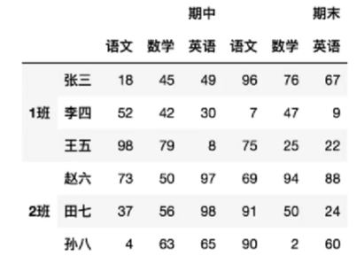

<a id="mulu">目录</a>
<a href="#mulu" class="back">回到目录</a>
<style>
    .back{width:40px;height:40px;display:inline-block;line-height:20px;font-size:20px;background-color:lightyellow;position: fixed;bottom:50px;right:50px;z-index:999;border:2px solid pink;opacity:0.3;transition:all 0.3s;color:green;}
    .back:hover{color:red;opacity:1}
    img{vertical-align:bottom;}
</style>

<!-- @import "[TOC]" {cmd="toc" depthFrom=3 depthTo=6 orderedList=false} -->

<!-- code_chunk_output -->

- [层次化索引](#层次化索引)
    - [创建](#创建)
      - [隐式构造](#隐式构造)
      - [显式构造](#显式构造)
    - [取索引](#取索引)
      - [series的索引](#series的索引)
      - [DataFrame的索引](#dataframe的索引)
    - [切片](#切片)
      - [series的切片](#series的切片)
      - [DataFrame的切片](#dataframe的切片)
    - [索引的堆叠](#索引的堆叠)
- [聚合函数](#聚合函数)
- [数据合并](#数据合并)
    - [concat](#concat)
    - [append](#append)
    - [merge（重点）](#merge重点)
      - [正常情况下合并](#正常情况下合并)
      - [key的规范化](#key的规范化)
      - [内/外/左/右连接](#内外左右连接)
- [各种值处理](#各种值处理)
    - [缺失值](#缺失值)
      - [判断缺失值](#判断缺失值)
      - [过滤数据](#过滤数据)
      - [填充](#填充)
    - [重复值](#重复值)
      - [检测重复的行](#检测重复的行)
      - [删除重复的行](#删除重复的行)
    - [异常值](#异常值)
- [数据映射](#数据映射)
    - [元素替换](#元素替换)
    - [数据映射](#数据映射-1)
      - [map](#map)
      - [apply](#apply)
      - [applymap](#applymap)
      - [transform](#transform)
    - [修改索引](#修改索引)
    - [重置索引](#重置索引)

<!-- /code_chunk_output -->

<!-- 打开侧边预览：f1->Markdown Preview Enhanced: open...
只有打开侧边预览时保存才自动更新目录 -->

### 层次化索引
{:width=200 height=200}
其中最外层的"期中"、"期末"以及"1班"、"2班"就是层次化索引
##### 创建
###### 隐式构造
最常用的方法是给df构造函数的index/columns参数传递一个二维数组，数组中每个元素为对应行/列的索引，这样每行/列就有多个行名/列名
```py
row = 4
col = 5
df = pd.DataFrame(
    data=np.array(range(col*row)).reshape(row, col),
    index=[['第一组行', '第一组行', '第二组行', '第二组行'], ['行1', '行2', '行3', '行4']],
    columns=[['第一组列', '第一组列', '第二组列', '第二组列', '第二组列'], ['列1', '列2', '列3', '列4', '列5']]
)
print(df)
```
```
             第一组列    第二组列        
             列1  列2   列3  列4  列5
第一组行 行1    0   1    2   3   4
        行2    5   6    7   8   9
第二组行 行3   10   11   12  13  14
        行4   15   16   17  18  19
```
series也可创建多层索引：
```py
s = pd.Series(data=np.array(range(row)), index=df.index)
print(s)
```
```
第一组行  行1    0
         行2    1
第二组行  行3    2
         行4    3
dtype: int32
```
###### 显式构造
`pd.MultiIndex`系列方法
- 使用**数组**
    ```py
    index = pd.MultiIndex.from_arrays([
    ['第一组行', '第一组行', '第二组行', '第二组行'],
    ['行1', '行2', '行3', '行4']])
    columns = pd.MultiIndex.from_arrays([
        ['第一组列', '第一组列', '第二组列', '第二组列', '第二组列'],
        ['列1', '列2', '列3', '列4', '列5']])
    df = pd.DataFrame(
        data=np.array(range(col*row)).reshape(row, col),
        index=index,
        columns=columns
    )
    ```
    这种方式与上面的隐式构造没有差别，`pd.MultiIndex.from_arrays`写不写都可以
- 使用**元组**：`pd.MultiIndex.from_tuples()`需要传入一个元组集合，里面的每个元素是一个元组，表示每行/每列拥有的索引名
    ```py
    index = pd.MultiIndex.from_tuples(
        (
            ('第一组行', '行1'), ('第一组行', '行2'), ('第二组行', '行3'), ('第二组行', '行4')
        )
    )
    columns = pd.MultiIndex.from_tuples(
        (
            ('第一组列', '列1'), ('第一组列', '列2'), ('第二组列', '列3'), ('第二组列', '列4'), ('第二组列', '列5')
        )
    )
    df = pd.DataFrame(
        data=np.array(range(col*row)).reshape(row, col),
        index=index,
        columns=columns
    )
    ```
- **笛卡尔积**：`(a,b)*(c,d)`=>`[(a,c),(a,d),(b,c),(b,d)]`
    `pd.MultiIndex.from_product()`接收一个二维数组，它产生的结果可类比上面的使用元组创建：`pd.MultiIndex.from_product([[a,b],[c,d]])`等同于`pd.MultiIndex.from_tuples(((a,c),(a,d),(b,c),(b,d)))`，即对二维数组中的元素进行笛卡尔积运算
    ```py
    index = pd.MultiIndex.from_product([
        ['第一组行', '第二组行'],
        ['行1', '行2']
    ])
    columns = pd.MultiIndex.from_product([
        ['第一组列'],
        ['列1', '列2', '列3', '列4', '列5']
    ])
    df = pd.DataFrame(
        data=np.array(range(col*row)).reshape(row, col),
        index=index,
        columns=columns
    )
    ```
    ```
                 第一组列                
                列1  列2  列3 列4 列5
    第一组行 行1   0   1   2   3   4
            行2   5   6   7   8   9
    第二组行 行1   10  11  12  13  14
            行2   15  16  17  18  19
    ```
    注意这种方式涉及到每层索引的依次组合，比较适用于：
    {:width=150 height=150}这种情况

这几种方式可以混合使用，比如index用`from_product()`，columns用`from_tuples()`
##### 取索引
###### series的索引
```
第一组行  行1    0
         行2    1
第二组行  行3    2
         行4    3
dtype: int32
```
**显式索引：**
根据外层索引取值：
```py
print(s['第一组行'])  # 或
print(s.loc['第一组行'])
```
```
行1    0
行2    1
dtype: int32
```
保留外层索引：
```py
print(s[['第一组行']])  # 也可以
print(s[['第一组行', '第二组行']])  # 同时取多个外层索引
```
```
第一组行  行1    0
         行2    1
第二组行  行3    2
         行4    3
dtype: int32
```
根据外层和内层索引：
```py
print(s['第一组行', '行1'])  # 也可以
print(s['第一组行']['行1'])  # 0
```
注意：根据显式索引取值时，当有外层索引时，不能直接使用之前的方法取内层索引，必须先说明外层索引，再在其中去取
```py
print(s['行1'])  # 报错
print(s.loc['行1'])  # 报错
```
---

**隐式索引：**
直接取的是内层索引的序号
```py
print(s[0])  # 0
print(s.iloc[1])  # 1
print(s.iloc[[1, 2]])
```
```
第一组行  行2    1
第二组行  行3    2
dtype: int32
```
###### DataFrame的索引
```
             第一组列    第二组列        
             列1  列2   列3  列4  列5
第一组行 行1    0   1    2   3   4
        行2    5   6    7   8   9
第二组行 行3   10   11   12  13  14
        行4   15   16   17  18  19
```
只需记住：df是按`df[外层列索引][内层列索引][外层行索引][内层行索引]`的顺序进行取值即可
df的隐式索引与series的隐式索引一样，直接取的是内层索引的序号
```py
print(df['第一组列'])
```
```
            列1  列2
第一组行 行1   0   1
        行2   5   6
第二组行 行3  10  11
        行4  15  16
```
```py
print(df['第一组列']['列1'])
```
```
第一组行  行1     0
         行2     5
第二组行  行3    10
         行4    15
Name: 列1, dtype: int32
```
```py
print(df['第一组列']['列1']['第一组行'])
```
```
行1    0
行2    5
Name: 列1, dtype: int32
```
```py
print(df['第一组列']['列1']['第一组行']['行1'])  # 0
```
当然，这种方法中`[[行/列]]`、`[行/列]`、`[行,列]`、`df.列名`、`loc`、`iloc`都可以混用（`[[]]`就是保留外层索引）
一些例子：
```py
df['第一组列', '列1']  # 等同于
df.第一组列.列1  # 取列1
df.iloc[:, 2]  # 取第三列
df.iloc[:, [2, 1]]  # 取第三、二列
df.loc[:, ('第一组列', '列1')]  # 取第一组列中的列1
df.loc['第一组行'].loc['行1']  # 取第一组行中的行1，也可以
df.loc[('第一组行', '行1')]  # 取行1
df.loc['第一组行', '第一组列']  # 取第一组行的第一组列
df.iloc[0]  # 取第一行
df.iloc[[0, 1]]  # 取第一、二行
```
注意特殊写法：`(外层索引, 内层索引)`表示取指定的内层索引，用来代替单索引时的`内层索引`

---

另一种取元素的方式：
```py
print(df.iloc[0, 1])  # 也可以
print(df.loc[('第一组行', '行1'), ('第一组列', '列2')])  # 1
```

##### 切片
###### series的切片
```
第一组行  行1    0
         行2    1
第二组行  行3    2
         行4    3
dtype: int32
```
**显式索引：**
根据外层索引：
```py
print(s['第一组行': '第二组行'])  # 也可以
print(s.loc['第一组行': '第二组行'])
```
```
第一组行  行1    0
         行2    1
第二组行  行3    2
         行4    3
dtype: int32
```
根据外层和内层索引：
```py
print(s.loc['第一组行'][0:2])
```
```
行1    0
行2    1
dtype: int32
```
**隐式索引：**
直接切片的是内层索引的序号
```py
print(s[1: 3])  # 也可以
print(s.iloc[1: 3])
```
```
第一组行  行2    1
第二组行  行3    2
dtype: int32
```
###### DataFrame的切片
```
             第一组列    第二组列        
             列1  列2   列3  列4  列5
第一组行 行1    0   1    2   3   4
        行2    5   6    7   8   9
第二组行 行3   10   11   12  13  14
        行4   15   16   17  18  19
```
一些例子：
```py
# 行切片
df.iloc[1: 5]  # 取第2-5行
df.loc['第一组行':'第二组行']  # 从外层索引第一组行切到第二组行
df.loc[('第一组行', '行1'), ('第二组行', '行2')]  # 从第一组行的行1切到第二组行的行2
# 列切片
df.iloc[:, 1:3]  # 取第2-3列
df.loc[:, '第一组列':'第二组列']  # 取外层的第一组列到第二组列
df.loc[:, ('第一组列', '列2'):('第二组列', '列2')]  # 报错，虽然按前面的逻辑来讲没问题
```
建议切片时使用隐式索引，更简便稳定
##### 索引的堆叠
```
             第一组列   第二组列    
             列1  列2   列1  列2
第一组行 行1    0   1    2   3
        行2    4   5    6   7
第二组行 行1    8   9   10  11
        行2   12   13   14  15
```
`df.stack(level=-1)`将列索引（默认是最内层列索引）变为最内层行索引
- `level`指定改变的是哪层索引，各层索引**从外至内**依次是0-n，-1就表示最内层索引

```py
print(df.stack())
```
```
                第一组列  第二组列
第一组行 行1 列1     0     2
            列2     1     3
        行2 列1     4     6
            列2     5     7
第二组行 行1 列1     8    10
            列2     9    11
        行2 列1    12    14
            列2    13    15
```
```py
print(df.stack(level=0))
```
```
                     列1  列2
第一组行 行1 第一组列   0   1
            第二组列   2   3
        行2 第一组列   4   5
            第二组列   6   7
第二组行 行1 第一组列   8   9
            第二组列  10  11
        行2 第一组列  12  13
            第二组列  14  15
```

---

`df.unstack(level=-1)`将行索引（默认是最内层列索引）变为最内层列索引
```
                第一组列  第二组列
第一组行 行1 列1     0     2
            列2     1     3
        行2 列1     4     6
            列2     5     7
第二组行 行1 列1     8    10
            列2     9    11
        行2 列1    12    14
            列2    13    15
```
```py
print(df2.unstack())
```
```
             第一组列    第二组列    
             列1  列2   列1  列2
第一组行 行1    0   1    2   3
        行2    4   5    6   7
第二组行 行1    8   9   10  11
        行2   12  13   14  15
```
```py
print(df2.unstack(level=0))
```
```
        第一组列          第二组列     
      第一组行 第二组行 第一组行 第二组行
行1 列1    0     8       2      10
    列2    1     9       3      11
行2 列1    4    12       6      14
    列2    5    13       7      15
```
level等于哪层索引，哪层索引就被切换到行/列中

---

可以在unstack函数中设置参数`fill_value`，指定df重排后缺失的值
```
             第一组列    第二组列    
             列1  列2   列1  列2
第一组行 行1    0   1    2   3
        行2    4   5    6   7
第二组行 行1    8   9   10  11
        行3   12  13   14  15
```
```py
print(df.unstack(fill_value=0))
```
```
          第一组列                      第二组列                  
          列1           列2             列1             列2       
          行1 行2  行3 行1 行2  行3   行1 行2  行3  行1 行2  行3
第一组行    0  4    0   1   5    0     2  6    0    3   7    0
第二组行    8  0   12   9   0   13    10  0   14   11   0   15
```
### 聚合函数
`df.sum(axis=0)`等，默认求多行数据的和
```
            第一组列    第二组列    
            列1  列2   列1  列2
第一组行 行1    0   1    2   3
        行2    4   5    6   7
第二组行 行1    8   9   10  11
        行2   12  13   14  15
```
```py
# 求所有数据的和
print(df.values.sum())  # 120
```
```py
print(df.sum())  # 求每一列多行数据的和
```
```
第一组列  列1    24
         列2    28
第二组列  列1    32
         列2    36
dtype: int64
```
```py
print(df.sum(axis=1))  # 求每一行多列数据的和
```
```
第一组行  行1     6
         行2    22
第二组行  行1    38
         行2    54
dtype: int64
```

---

特殊：根据指定层索引计算
`df.sum(axis=0,level=-1)`其中level控制根据哪层索引计算，如
```py
print(df.sum(axis=0, level=0))
```
就表示计算行数据的和，且计算时按最外层行索引分组，每组计算和
```
         第一组列   第二组列    
         列1  列2   列1  列2
第一组行    4   6    8  10
第二组行   20  22   24  26
```
```py
print(df.sum(axis=1, level=0))
```
```
            第一组列  第二组列
第一组行 行1     1     5
        行2     9    13
第二组行 行1    17    21
        行2    25    29
```
### 数据合并
为方便说明，使用`make_df`函数生成固定数据格式的df：列索引为ABCDE...，行索引为12345...，每个元素就是列索引+行索引（即A1 B2 C3...）的形式
```py
def make_df(row: int, col: int):
    index = [str(i) for i in range(1, row+1)]
    columns = [chr(ord('A')+i) for i in range(col)]
    data = []
    for i in index:
        row_data = []
        for j in columns:
            row_data.append(j+i)
        data.append(row_data)
    return pd.DataFrame(data=data, index=index, columns=columns)
df = make_df(4, 5)
```
```
    A   B   C   D   E
1  A1  B1  C1  D1  E1
2  A2  B2  C2  D2  E2
3  A3  B3  C3  D3  E3
4  A4  B4  C4  D4  E4
```
##### concat
`pd.concat([df1,df2,...],axis=0)`默认上下（垂直）合并，设置axis=1即为左右（水平）合并
```py
df1 = make_df(2, 2)
df2 = make_df(3, 2)
print(pd.concat([df1, df2]))
```
```
    A   B
1  A1  B1
2  A2  B2
1  A1  B1
2  A2  B2
3  A3  B3
```
```py
print(pd.concat([df1, df2], axis=1))
```
```
     A    B   A   B
1   A1   B1  A1  B1
2   A2   B2  A2  B2
3  NaN  NaN  A3  B3
```
其它参数：
- `ignore_index=False`当设置为True时忽略行索引，即对结果df的行索引重新按01234...的顺序赋值
- `keys=[i1,i2,...]`设置多层索引，即将结果df中原来来自df1的数据设置外层索引i1，原来来自df2的数据设置外层索引i2...注意它不能与`ignore_index`一起用
    ```py
    print(pd.concat([df1, df2], keys=['df1', 'df2']))
    ```
    ```
            A   B
    df1 1  A1  B1
        2  A2  B2
    df2 1  A1  B1
        2  A2  B2
        3  A3  B3
    ```
- `join='outer'`**不匹配连接：**级联维度的索引不一致，如垂直级联时列索引不一致、水平级联时行索引不一致
    join就是指定了级联的方式
    - `outer`外连接，保留所有行/列，缺的值用NaN补上
    - `inner`内连接，只保留共有的行/列

    ```py
    df1 = make_df(2, 2)
    df2 = make_df(2, 3)
    print(pd.concat([df1, df2]))
    ```
    ```
        A   B    C
    1  A1  B1  NaN
    2  A2  B2  NaN
    1  A1  B1   C1
    2  A2  B2   C2
    ```
    ```py
    print(pd.concat([df1, df2],join='inner'))
    ```
    ```
        A   B
    1  A1  B1
    2  A2  B2
    1  A1  B1
    2  A2  B2
    ```
##### append
`df1.append(df2, ignore_index=False)`将df2追加到df1的后面，进行垂直合并，保留全部列
相当于`pd.concat([df1,df2],axis=0,join='outer)`
新版本中该函数可能被改成了`_append`
##### merge（重点）
与前面两种方法的区别：需要根据某一共同的行/列进行合并
`pd.merge(df1,df2)`/`df1.merge(df2)`会自动找到它们相同的列，将其作为key合并，默认内连接
###### 正常情况下合并
**一对一合并：**
一对一：就是指第一个表中只有一行id为2的值，第二个表中也只有一行id为2的值
```
  name  id  age
0  abc   1   11
1  bcd   2   12
2  cde   3   13
```
```
  sex  id
0   m   2
1   f   3
2   m   4
```
观察上面两个表，有共同列`id`
```py
print(pd.merge(df1, df2))
```
```
  name  id  age sex
0  bcd   2   12   m
1  cde   3   13   f
```
即将第一个表中id为2的name、age与第二个表中id为2的sex合并成一行，第一个表中id为3的name、age与第二个表中id为3的sex合并成一行
第一个表中没有id为4的行，第二个表中没有id为1的行，所以这两行数据就被丢弃（进行内连接，保留共有值）

---

**多对一合并：**
```
  name  id  age
0  abc   1   11
1  bcd   2   12
2  cde   2   13
```
```
  sex  id
0   m   2
1   f   3
2   m   4
```
可以看到第一个表中有多个id=2，这种情况下会将第一个表中所有id为2的name、age与第二个表中id为2的sex合并成一行
```py
print(pd.merge(df1, df2))
```
```
  name  id  age sex
0  bcd   2   12   m
1  cde   2   13   m
```

---

**多对多合并：**
```
  name  id  age
0  abc   1   11
1  bcd   2   12
2  cde   2   13
```
```
  sex  id
0   m   2
1   f   2
2   m   4
```
可以看到第一个表中有多个id=2，第二个表中也有多个id=2这种情况下会将第一个表中所有id为2的name、age与第二个表中所有id为2的sex全部组合（笛卡尔积）
```py
print(pd.merge(df1, df2))
```
```
  name  id  age sex
0  bcd   2   12   m
1  bcd   2   12   f
2  cde   2   13   m
3  cde   2   13   f
```
###### key的规范化
**当两个df有多个列相同时**：使用`on`参数显式指定哪列为key
```
  name  id  age
0  abc   1   11
1  bcd   2   12
2  cde   3   13
```
```
  name sex  id
0  abc   m   2
1  bcd   f   3
2  cde   m   4
```
```py
print(pd.merge(df1, df2))  # 空df，默认必须name和id全部对应才保留
print(pd.merge(df1, df2, on='id'))  # 只要id相同就连接
```
```
  name_x  id  age name_y sex
0    bcd   2   12    abc   m
1    cde   3   13    bcd   f
```
观察上表，因为合并后结果中有`df1`的name列和`df2`的name列，需要进行区分，于是自动添加了`_x`和`_y`后缀
使用参数`suffixes=['_df1','_df2']`进行更改

---

**当两个df没有相同列时**：使用`left_on`和`right_on`参数指定两个表中不同列作为连接的key
```
  name1  id1  age
0   abc    1   11
1   bcd    2   12
2   cde    3   13
```
```
  name2 sex  id2
0   abc   m    2
1   bcd   f    3
2   cde   m    4
```
```py
print(pd.merge(df1, df2))  # 报错，没有相同的列
print(pd.merge(df1, df2, left_on='id1', right_on='id2'))
```
```
  name1  id1  age name2 sex  id2
0   bcd    2   12   abc   m    2
1   cde    3   13   bcd   f    3
```

---

**使用行索引作key**：使用`left_index=True`和`right_index=True`分别指定是否使用左/右表中的行索引作为连接的key
```
  name1  id1  age
0   abc    1   11
1   bcd    2   12
2   cde    3   13
```
```
  name2 sex  id2
0   abc   m    2
1   bcd   f    3
2   cde   m    4
```
```py
print(pd.merge(df1, df2, left_index=True, right_index=True))  # 相同索引的行拼接
```
```
  name1  id1  age name2 sex  id2
0   abc    1   11   abc   m    2
1   bcd    2   12   bcd   f    3
2   cde    3   13   cde   m    4
```
`left/right_on`和`left/right_index`可以混用，目的都是指定左右两表中作为key的列
```py
print(pd.merge(df1, df2, left_index=True, right_on='id2'))  # [0,1,2]∩[2,3,4]，结果是df1中索引为2的行和df2中id2为2的行
```
```
  name1  id1  age name2 sex  id2
0   cde    3   13   abc   m    2
```
###### 内/外/左/右连接
默认是内连接，只保留key列中相同的值
也可以指定参数`how='outer'/'left'/'right'`设定外/左/右连接
左连接：在保留共有值基础上，加上只在左边出现的值，即保留左边的所有值。同理右连接就是保留右边的所有值
```
  name  id  age
0  abc   1   11
1  bcd   2   12
2  cde   3   13
```
```
  sex  id
0   m   2
1   f   3
2   m   4
```
```py
print(pd.merge(df1, df2, how='outer'))
```
```
  name  id   age  sex
0  abc   1  11.0  NaN
1  bcd   2  12.0    m
2  cde   3  13.0    f
3  NaN   4   NaN    m
```
```py
print(pd.merge(df1, df2, how='left'))
```
```
  name  id  age  sex
0  abc   1   11  NaN
1  bcd   2   12    m
2  cde   3   13    f
```
```py
print(pd.merge(df1, df2, how='right'))
```
```
  name  id   age sex
0  bcd   2  12.0   m
1  cde   3  13.0   f
2  NaN   4   NaN   m
```
### 各种值处理
##### 缺失值
有两种缺失值：
- `None`是python自带的空对象，不能参与到任何计算中，它的运算要比int类型的慢
- `np.nan`是np包提供的浮点类型的空的对象，能参与到计算中，但计算结果都为`np.nan`

pandas中`None`和`np.nan`都视作`np.nan`
###### 判断缺失值
`df.isnull()`/`df.notnull()`结果是一个与df尺寸相等的新df，每个元素是一个bool值，标识df上这个位置上的元素是不是nan
```
    A   B   C    D     E
1  A1  B1  C1   D1    E1
2  A2  B2  C2   D2  None
3  A3  B3  C3  NaN    E3
4  A4  B4  C4   D4    E4
5  A5  B5  C5   D5    E5
```
```py
print(df.isnull())
```
```
       A      B      C      D      E
1  False  False  False  False  False
2  False  False  False  False   True
3  False  False  False   True  False
4  False  False  False  False  False
5  False  False  False  False  False
```
找到全部/部分为空的行/列：使用`all()`和`any()`函数
- `all()`：必须一行/列全为True才为True
- `any()`：一行/列中有一个True就为True

常用形式：
```py
df.isnull().any()  # 找到有空值的列
df.notnull().all()  # 找到没有空值的列
df.isnull().any(axis=1)  # 找到有空值的行
df.notnull().all(axis=1)  # 找到没有空值的行
```
例：
```
    A   B   C    D    E
1  A1  B1  C1   D1   E1
2  A2  B2  C2   D2  NaN
3  A3  B3  C3  NaN   E3
4  A4  B4  C4   D4   E4
5  A5  B5  C5   D5   E5
```
```
# 有空值的列
A    False
B    False
C    False
D     True
E     True
dtype: bool
```
```
# 没有空值的列
A     True
B     True
C     True
D    False
E    False
dtype: bool
```
```
# 有空值的行
1    False
2     True
3     True
4    False
5    False
dtype: bool
```
```
# 没有空值的行
1     True
2    False
3    False
4     True
5     True
dtype: bool
```
###### 过滤数据
- 使用bool值索引：
  ```py
  # 过滤掉有空的行
  df[~df.isnull().any(axis=1)]  # 或者
  df[df.notnull().all(axis=1)]
  # 过滤掉有空的列
  df.loc[:,~df.isnull().any()]  # 或者
  df.loc[:,df.notnull().all()]
  ```
  这种方式用处广泛，将上面的`isnull()`和`notnull()`换成其它的条件就可以进行更多的过滤操作
- 使用`df.dropna()`函数
  ```py
  df.dropna()  # 过滤掉有空的行
  df.dropna(axis=1)  # 过滤掉有空的列
  ```
  可以选择过滤的方式`how='any'`，将'any'默认值改成'all'就表明所有都为空才过滤
  ```py
  df.dropna(how='all')  # 过滤掉所有数据都为空的行
  df.dropna(axis=1, how='all')  # 过滤掉所有数据都为空的列
  ```
  还可以设置参数`inplace=False`控制是否修改原数据，默认不修改

例：
```
    A   B   C    D    E
1  A1  B1  C1   D1   E1
2  A2  B2  C2   D2  NaN
3  A3  B3  C3  NaN   E3
4  A4  B4  C4   D4   E4
5  A5  B5  C5   D5   E5
```
```
# 过滤掉有空的行
    A   B   C   D   E
1  A1  B1  C1  D1  E1
4  A4  B4  C4  D4  E4
5  A5  B5  C5  D5  E5
```
```
# 过滤掉有空的列
    A   B   C
1  A1  B1  C1
2  A2  B2  C2
3  A3  B3  C3
4  A4  B4  C4
5  A5  B5  C5
```
###### 填充
`df.fillna(value,limit=无限次,inplace=False,method=None,axis=0)`
- `value`指定将nan填充成的值（必需）
- `limit`指定填充次数
- `inplace=False`控制是否修改原数据
- `method`指定填充方法
  - `pad`/`ffill`向前填充，即使用nan上面的元素填充它
  - `backfill`/`bfill`向后填充，即使用nan下面的元素填充它
- `axis`通常与`method`配合使用，当设置`axis=1`时，向前填充变成向左填充（使用nan左面的元素填充它），向后填充变成向右填充（使用nan右面的元素填充它）
其中必需指定`method`或者`value`参数来说明填充值
```
    A   B   C    D    E
1  A1  B1  C1   D1   E1
2  A2  B2  C2   D2  NaN
3  A3  B3  C3  NaN   E3
4  A4  B4  C4   D4   E4
5  A5  B5  C5   D5   E5
```
```
# df.fillna(method='ffill')
    A   B   C   D   E
1  A1  B1  C1  D1  E1
2  A2  B2  C2  D2  E1
3  A3  B3  C3  D2  E3
4  A4  B4  C4  D4  E4
5  A5  B5  C5  D5  E5
```
```
# df.fillna(method='bfill', axis=1)
    A   B   C   D    E
1  A1  B1  C1  D1   E1
2  A2  B2  C2  D2  NaN
3  A3  B3  C3  E3   E3
4  A4  B4  C4  D4   E4
5  A5  B5  C5  D5   E5
```
##### 重复值
###### 检测重复的行
`df.duplicated(keep='first',subset=[列名1,列名2,..])`判断各行是否与前面的行重复，如果有就标记为True
- `keep`参数指定判断的顺序，当设置为
  - `'first'`时，是从前向后判断，依次比较后面的行是否与前面的行重复
  - `'last'`时，是从后向前判断，依次比较前面的行是否与后面的行重复
  - `False`时，只要某行在整个df中有与它重复的，就标记为True
- `subset`指定判断行中哪些列重复，默认只有行中所有列相同时，才判定为重复

```
# 让第2行与第1行相同
    A   B   C   D   E
1  A1  B1  C1  D1  E1
2  A1  B1  C1  D1  E1
3  A3  B3  C3  D3  E3
4  A4  B4  C4  D4  E4
5  A5  B5  C5  D5  E5
```
```
# df.duplicated()
1    False
2     True
3    False
4    False
5    False
dtype: bool
```
```
# df.duplicated(keep='last')
1     True
2    False
3    False
4    False
5    False
dtype: bool
```
###### 删除重复的行
`df.drop_duplicates(keep='first',subset=[列名1,列名2,..])`参数与`duplicated`相同，区别是它直接删除掉重复的行
```
# 让第2行的B列与第1行的相同
    A   B   C   D   E
1  A1  B1  C1  D1  E1
2  A2  B1  C2  D2  E2
3  A3  B3  C3  D3  E3
4  A4  B4  C4  D4  E4
5  A5  B5  C5  D5  E5
```
```
# df.drop_duplicates(keep=False, subset=['B'])
    A   B   C   D   E
3  A3  B3  C3  D3  E3
4  A4  B4  C4  D4  E4
5  A5  B5  C5  D5  E5
```
##### 异常值

### 数据映射
##### 元素替换
`df.replace({旧值1:新值1,旧值2:新值2,...})`将df中的旧值替换成新值
```
    A   B   C   D   E
1  A1  B1  C1  D1  E1
2  A2  B2  C2  D2  E2
3  A3  B3  C3  D3  E3
4  A4  B4  C4  D4  E4
5  A5  B5  C5  D5  E5
```
```
# df.replace({'B3': 'b3', 'A1': "a1"})
    A   B   C   D   E
1  a1  B1  C1  D1  E1
2  A2  B2  C2  D2  E2
3  A3  b3  C3  D3  E3
4  A4  B4  C4  D4  E4
5  A5  B5  C5  D5  E5
```
##### 数据映射
本节中使用数据：
```py
df = pd.DataFrame(data=np.random.randint(0,100,size=(4,5)), index=list('abcd'), columns=list('ABCDE'))
print(df)
```
```
    A   B   C   D   E
a  34  32  96  85  20
b  90  86  48  43  56
c  97  93  88  24   4
d   4  62  49  87  90
```
###### map
map函数一般用于series数据结构，不能用于df
`s.map(func)`其中func指对s中每个元素的处理函数，需要有返回值，可以是lambda匿名函数
例：
```py
df['A'] = df['A'].map(lambda x: x*10)  # 将A2列的每个元素*10并保存
def is_pass(n):
    if n >= 80:
        return '良好'
    elif n >= 60:
        return '及格'
    else:
        return '不及格'
df['B_is_pass'] = df['B'].map(is_pass)  # 新增一列B_is_pass，标明B列值是否>60
print(df)
```
```
     A   B   C   D   E B_is_pass
a  340  32  96  85  20    不及格
b  900  86  48  43  56    良好
c  970  93  88  24   4    良好
d   40  62  49  87  90    及格
```
###### apply
`s/df.apply(func)`
apply既可用于series也可用于df
当用于series时，与[map](#map)相同
当用于df时，传入func函数的参数是每一个行/列，使用参数`axis=0/1`进行控制
例：
```py
print(df.apply(lambda x: x.mean()))  # 求每一列数据平均值
```
```
A    56.00
B    61.00
C    30.00
D    73.50
E    55.25
dtype: float64
```
```py
print(df.apply(lambda x: x.mean(), axis=1))   # 求每一行数据平均值
```
```
a    68.0
b    49.4
c    57.4
d    45.8
dtype: float64
```
如果想同时计算平均值和中值，可以将它们装到一个元组中返回
```py
def func(x):
    mean = np.round(x.mean())
    mid = np.round(x.median())
    return (mean, mid)
print(df.apply(func))  # 求每一列数据平均值和中值
```
```
      A     B     C     D     E
0  60.0  33.0  57.0  57.0  33.0
1  56.0  26.0  50.0  54.0  32.0
```
###### applymap
只可用于df，传入func函数的参数是每一个元素
例：
```py
# 将每个元素都+100
df.applymap(lambda x: x + 100)
```
注：在较新版本中，df的applymap方法与map方法合并，可以使用map处理df
###### transform
transform既可用于series也可用于df
`s/df.transform(func)`或`s/df.transform([func1,func2,...])`可接收多个函数进行多项处理
当用于series时，传入每个func的是每个元素
当用于df时，传入每个func函数的参数是每一个行/列，使用参数`axis=0/1`进行控制（同[apply](#apply)）
例：
```py
print(df['A'].transform([np.sqrt, np.exp]))
```
```
       sqrt           exp
a  6.633250  1.285160e+19
b  7.416198  7.694785e+23
c  6.633250  1.285160e+19
d  5.567764  2.904885e+13
```
##### 修改索引
`df.rename({旧索引1:新索引1,旧索引2:新索引2,...},axis=0)`默认修改行索引，将axis设为1修改列索引，也可以
```py
df.rename(index={旧行索引1:新行索引1,旧行索引2:新行索引2,...},
          colums={旧列索引1:新列索引1,旧列索引2:新列索引2,...})
```
例：
```
    A   B   C   D   E
1  A1  B1  C1  D1  E1
2  A2  B2  C2  D2  E2
3  A3  B3  C3  D3  E3
4  A4  B4  C4  D4  E4
5  A5  B5  C5  D5  E5
```
```py
df = df.rename({'1': '一', '2': '二'})
df = df.rename(columns={'A': 'a'})
```
```
    a   B   C   D   E
一  A1  B1  C1  D1  E1
二  A2  B2  C2  D2  E2
3  A3  B3  C3  D3  E3
4  A4  B4  C4  D4  E4
5  A5  B5  C5  D5  E5
```
##### 重置索引
`df.reset_index()`将原行索引变为df中的一列，列名为'index'，新行索引为1-n
`df.set_index(keys=['列名'])`将指定列变为行索引，原行索引删除
例：
```
    A   B   C   D   E
1  A1  B1  C1  D1  E1
2  A2  B2  C2  D2  E2
3  A3  B3  C3  D3  E3
4  A4  B4  C4  D4  E4
5  A5  B5  C5  D5  E5
```
```
# df.reset_index()
  index   A   B   C   D   E
0     1  A1  B1  C1  D1  E1
1     2  A2  B2  C2  D2  E2
2     3  A3  B3  C3  D3  E3
3     4  A4  B4  C4  D4  E4
4     5  A5  B5  C5  D5  E5
```
```
# df.set_index(keys=['A'])
     B   C   D   E
A                 
A1  B1  C1  D1  E1
A2  B2  C2  D2  E2
A3  B3  C3  D3  E3
A4  B4  C4  D4  E4
A5  B5  C5  D5  E5
```
