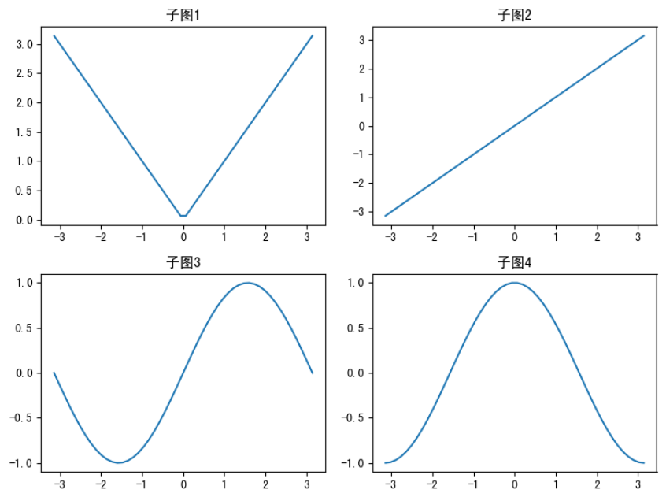
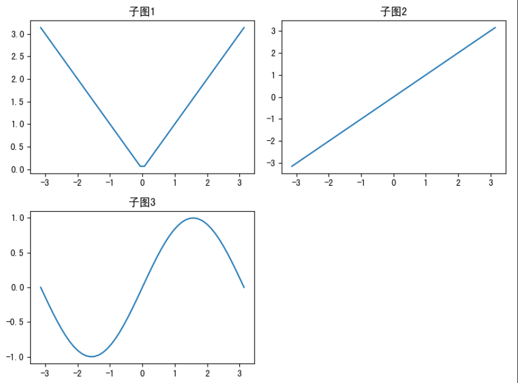
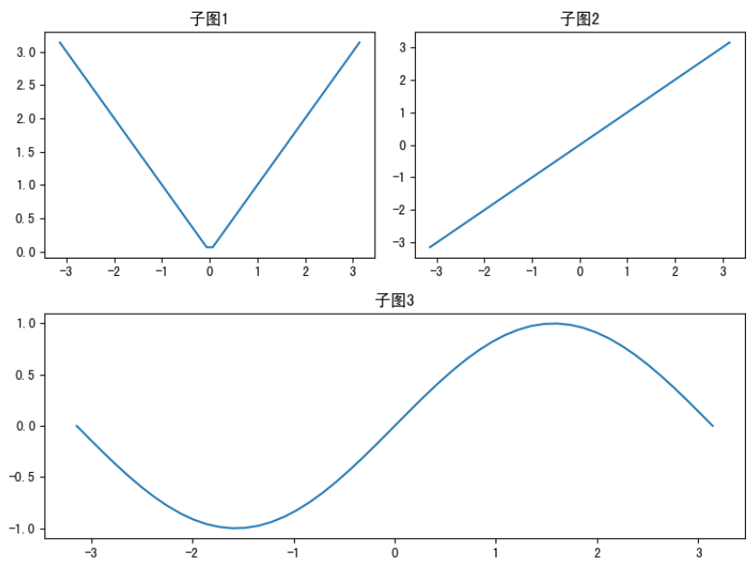
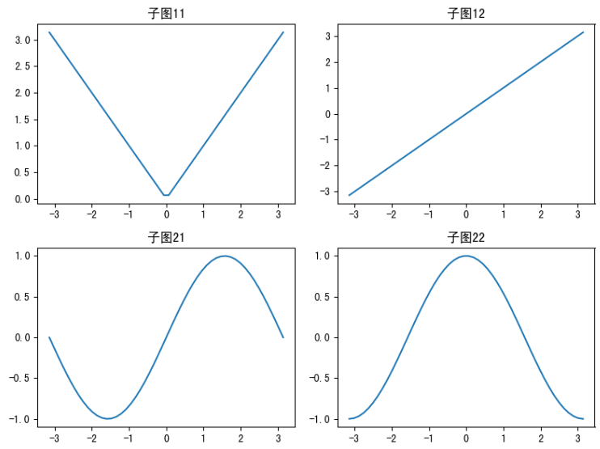
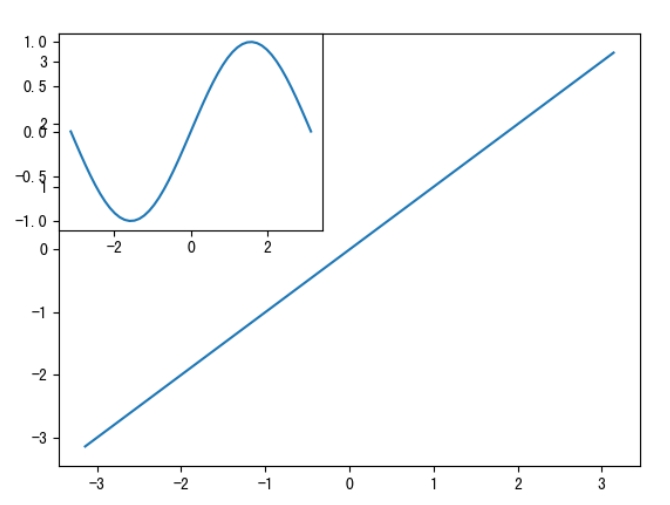
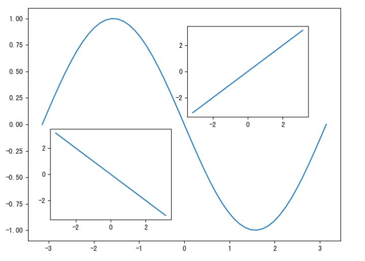
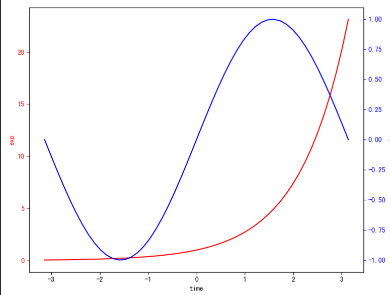
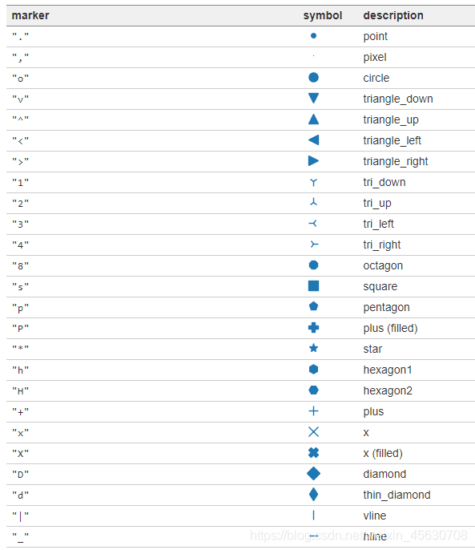
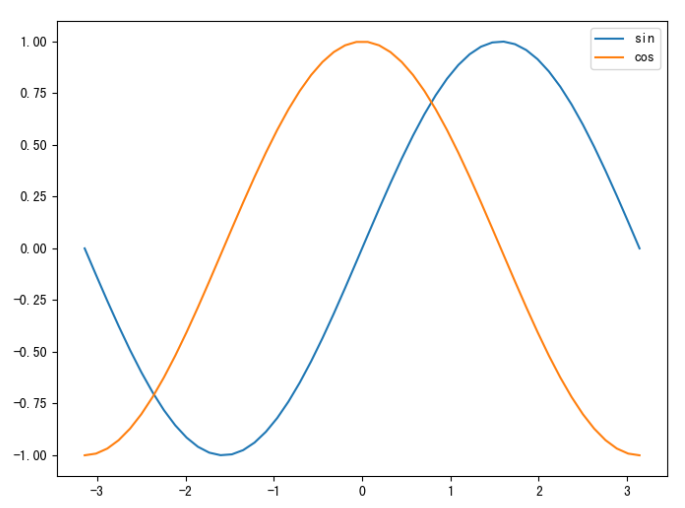
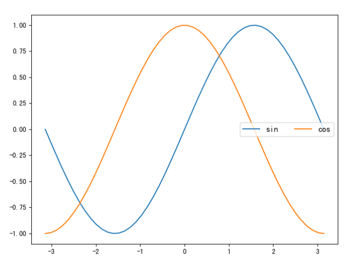

<a id="mulu">目录</a>
<a href="#mulu" class="back">回到目录</a>
<style>
    .back{width:40px;height:40px;display:inline-block;line-height:20px;font-size:20px;background-color:lightyellow;position: fixed;bottom:50px;right:50px;z-index:999;border:2px solid pink;opacity:0.3;transition:all 0.3s;color:green;}
    .back:hover{color:red;opacity:1}
    img{vertical-align:bottom;}
</style>

<!-- @import "[TOC]" {cmd="toc" depthFrom=3 depthTo=6 orderedList=false} -->

<!-- code_chunk_output -->

- [预先配置](#预先配置)
- [matplotlib画图的基本原理](#matplotlib画图的基本原理)
- [画布配置](#画布配置)
- [多图布局](#多图布局)
    - [m行n列的子图](#m行n列的子图)
      - [subplot](#subplot)
      - [subplots](#subplots)
    - [图形嵌套](#图形嵌套)
      - [add_subplot](#add_subplot)
      - [axes和add_axes](#axes和add_axes)
    - [双轴显示](#双轴显示)
- [绘图函数参数](#绘图函数参数)
    - [颜色和点线样式](#颜色和点线样式)
- [绘图属性](#绘图属性)
    - [图例legend](#图例legend)
    - [](#)

<!-- /code_chunk_output -->

<!-- 打开侧边预览：f1->Markdown Preview Enhanced: open...
只有打开侧边预览时保存才自动更新目录 -->

```py
import numpy as np
import pandas as pd
import matplotlib.pyplot as plt
```
### 预先配置
- 查看自己电脑上的字体库
    ```py
    from matplotlib.font_manager import FontManager
    fm = FontManager()
    print(set(f.name for f in fm.ttflist))
    ```
- 让图片可以显示中文
    ```py
    plt.rcParams['font.sans-serif'] = ['SimHei']  # 此处字体应为上面电脑中有的字体
    ```
    如果需要下载字体以解决中文显示问题，可以参考[]
- 让图片可以显示负号
    ```py
    plt.rcParams['axes.unicode_minus'] = False
    ```
- [输出/保存矢量图](https://blog.csdn.net/sinat_39620217/article/details/119924912)
### matplotlib画图的基本原理
matplotlib的三层结构：
- **容器层**：最底部是画板层（多数情况下不需手动创建/更改），之上是画布层(figure)，最上方是绘图区（坐标系subplots），由两个坐标轴axes构成
- **辅助显示层**：坐标刻度、网格等使图像更方便看图的工具
- **图像层**：可以画各种各样的图表，设置图表颜色风格等等，这两层都运行在绘图区之上

常见的画图流程：
```py
# 可选：修改画布配置
plt.figure(figsize=(20,8),dpi=80)
# 必需：画图函数
plt.plot([1,2,3,4,5,6,7],[17,17,18,15,11,11,12])
# 可选：修改刻度、坐标轴标签，增加网格等等（辅助显示层）
plt.yticks(range(0,40,5))
# 可选：保存画图结果
plt.savefig("折线图1.png")
# 必需：展示图片（在pycharm中必需，ipynb中可省略）
plt.show()
```
注意：画图函数可以有多个，可以画在同一张图上；`plt.show()`是展示画的图片，同时清空画布和画布配置、重新开始画图，可以认为有几个show就画几张图
```py
x = np.linspace(0, 2*np.pi)
plt.figure(facecolor='#11aa11')
plt.plot(x, np.sin(x))
plt.plot(x, np.cos(x), 'r')
plt.plot(x, np.tan(x), 'g--')
plt.show()
```
{:width=300 height=300}
```py
x = np.linspace(0, 2*np.pi)
plt.figure(facecolor='#11aa11')
plt.plot(x, np.sin(x))
plt.show()
plt.plot(x, np.cos(x), 'r')
plt.plot(x, np.tan(x), 'g--')
plt.show()
```
{:width=300 height=300}
可以看到有两张图，第二张图中不继承第一张图的画布配置和绘图函数
### 画布配置
使用绘图函数作出的图都是在画布(figure)上展示的
使用函数`plt.figure()`可以更改画布的属性，参数：
- `figsize=(width, height)`设置画布宽高，一般情况下都是取小于10的整数
- `dpi=n`分辨率（像素密度），一般都是取整百的数，分辨率越大则图越大越清晰
- `facecolor=颜色`背景颜色

```py
x = np.linspace(0, 2*np.pi)
y = np.sin(x) # y=sin(x)
plt.figure(
    figsize=(3, 2),
    dpi=100,
    facecolor='#11aa11'
)
plt.plot(x, y)
plt.show()
```
{:width=300 height=300}
### 多图布局
##### m行n列的子图
###### subplot
`子图对象=plt.subplot(三位整数)`
例如`ax1=plt.subplot(231)`就代表`ax1`是**2**行**3**列中的第**1**个图，也可以写成`subplot(2,3,1)`的形式
之后的画图都是对`ax1`进行操作
```py
fig = plt.figure(figsize=(8, 6))  # 创建画布
x = np.linspace(-np.pi, np.pi)
ax1 = plt.subplot(221)  # 第一个图
ax1.plot(x, np.abs(x))
ax1.set_title("子图1")
ax2 = plt.subplot(222)  # 第二个图
ax2.plot(x, x)
ax2.set_title("子图2")
ax3 = plt.subplot(2, 2, 3)  # 第三个图
ax3.plot(x, np.sin(x))
ax3.set_title("子图3")
ax4 = plt.subplot(2, 2, 4)  # 第四个图
ax4.plot(x, np.cos(x))
ax4.set_title("子图4")
fig.tight_layout()  # 使用紧凑布局
plt.show()
```
{:width=400 height=400}
注意：`ax1=plt.subplot(231)`实际是先把画布分成3x2个格子（每行都有3个格子，共2行），之后让`ax1`进入第一个格子
这就是说，虽然我们指定了2行3列布局，也可以只画<6个图，多余的位置为空白
```py
fig = plt.figure(figsize=(8, 6))
x = np.linspace(-np.pi, np.pi)
ax1 = plt.subplot(221)  # 第一个图
ax1.plot(x, np.abs(x))
ax1.set_title("子图1")
ax2 = plt.subplot(222)  # 第二个图
ax2.plot(x, x)
ax2.set_title("子图2")
ax3 = plt.subplot(2, 2, 3)  # 第三个图
ax3.plot(x, np.sin(x))
ax3.set_title("子图3")
fig.tight_layout()
plt.show()
```
{:width=400 height=400}
特殊情况：让第二行只画一个图，且占满全部的行
第一行的两个图不变，然后把画布分成1x2个格子，即两行一列，让第三个图进入第2个格子（第2行）：`subplot(2, 1, 1)`
```py
fig = plt.figure(figsize=(8, 6))
x = np.linspace(-np.pi, np.pi)
ax1 = plt.subplot(221)  # 第一个图
ax1.plot(x, np.abs(x))
ax1.set_title("子图1")
ax2 = plt.subplot(222)  # 第二个图
ax2.plot(x, x)
ax2.set_title("子图2")
ax3 = plt.subplot(2, 1, 2)  # 第三个图
ax3.plot(x, np.sin(x))
ax3.set_title("子图3")
fig.tight_layout()
plt.show()
```
{:width=400 height=400}
###### subplots
`subplots(m,n)`创建m行n列的画布格子，返回一个二元组，分别是画布对象fig和一个m行n列的二维列表，元素为子图对象
接收方式：
```py
fig, ax = plt.subplots(2, 2)
ax1, ax2 = ax  # ax1表示第一行的两个图，ax2表示第二行的两个图
ax11, ax12 = ax1  # ax11表示第一行的第一个图，ax12表示第一行的第二个图
ax21, ax22 = ax2  # ax21表示第二行的第一个图，ax22表示第二行的第二个图
```
ax11/12/21/22的使用方式同[subplot](#subplot)
例：
```py
fig, ax = plt.subplots(2, 2)
ax1, ax2 = ax
ax11, ax12 = ax1
ax21, ax22 = ax2
fig.set_figwidth(8)
fig.set_figheight(6)  # 设置画布宽高，相当于plt.figure(figsize=(8, 6))
x = np.linspace(-np.pi, np.pi)
ax11.plot(x, np.abs(x))
ax11.set_title("子图11")
ax12.plot(x, x)
ax12.set_title("子图12")
ax21.plot(x, np.sin(x))
ax21.set_title("子图21")
ax22.plot(x, np.cos(x))
ax22.set_title("子图22")
fig.tight_layout()  # 使用紧凑布局
plt.show()
```
{:width=400 height=400}
##### 图形嵌套
###### add_subplot
`子图对象=fig.add_subplot()`用于向已有图中叠加新图
传入参数与[subplot](#subplot)类似，都是接收一个三位数/3个整数，其实就是把已有的图当成了画布，再画新的子图
```py
x = np.linspace(-np.pi, np.pi)
fig = plt.figure()  # 创建画布对象
plt.plot(x, x)  # 已有图
ax = fig.add_subplot(221)  # 在2x2格子的第一个位置（左上角）
ax.plot(x, np.sin(x))  # 嵌套图
plt.show()
```
{:width=400 height=400}
###### axes和add_axes
`子图对象=plt.axes([left, bottom, width, height])`
`子图对象=fig.add_axes([left, bottom, width, height])`
- left和bottom为图距已有图左/下方的距离百分比
- width和height为新图的宽高占已有图的百分比

```py
x = np.linspace(-np.pi, np.pi)
fig = plt.figure(figsize=(8, 6))  # 创建画布对象
plt.plot(x, -np.sin(x))  # 已有图
ax1 = plt.axes([0.18, 0.18, 0.3, 0.3])
ax1.plot(x, -x)  # 嵌套图1
ax2 = fig.add_axes([0.52, 0.52, 0.3, 0.3])
ax2.plot(x, x)  # 嵌套图2
plt.show()
```
{:width=400 height=400}
##### 双轴显示
使用场景：两条线共享x轴，但分别使用不同的y轴（左侧和右侧y轴）
方法：
```
子图对象1 = plt.gca()  # 获得当前xy轴轴域
子图对象2 = 子图对象1.twinx()  # 和子图对象1共享x轴
```
具体例子：
```py
x = np.linspace(-np.pi, np.pi)
ax1 = plt.gca()  # 第一个图
ax1.plot(x, np.exp(x), c='r')  # 画第一个图
ax1.set_xlabel('time')
ax1.set_ylabel('exp', color='r')  # 设置图1的xy轴标签
ax1.tick_params(axis='y', colors='red')  # 更改图1的y轴颜色
ax2 = ax1.twinx()  # 第二个图
ax2.plot(x, np.sin(x), c='b')  # 画第二个图
ax2.set_ylabel('sin', color='b')  # 设置图2的xy轴标签
ax2.tick_params(axis='y', colors='blue')  # 更改图2的y轴颜色
plt.tight_layout()  # 使用紧凑布局
plt.show()
```
{:width=300 height=300}
### 绘图函数参数
以最基本的绘图函数`plt.plot()`为例，一般情况下需要传入两个参数，第一个是x值，第二个是y值
##### 颜色和点线样式
- `color`或简写`c`：设定颜色，可以使用颜色的简写（b蓝色、g绿色、r红色、c青色、m品红、y黄色、k黑色、w白色...），也可以是颜色全称（orange橙色...），还可以是16进制颜色（`#11aa11`这种，但不能是`#fff`这种简写）
    注意：之后所有在plt中设置的关于颜色的取值都同上
- `linestyle`或简写`ls`：设定线的样式，可以取值--`'-'`实线（默认值）、`'--'`虚线、`'-.'`点虚线、`':'`点线...
    ```py
    x = np.linspace(-5, 5, 100)  # 在-5至5的范围内取100个点
    y = x**2  # y=x^2
    plt.plot(x, y, c='red', ls='--')
    plt.show()
    ```
    {:width=300 height=300}
    上面两个参数也合并到一起，如上面的`c='red', ls='--'`就可写成`'r--'`
    ```py
    plt.plot(x, y, 'b:')
    plt.show()
    ```
    {:width=300 height=300}
- `marker`标记，即数据点形状，[更多marker](https://www.cnblogs.com/Big-Big-Watermelon/p/14052165.html)
    {:width=600 height=600}
  - `markersize`数据点大小，取值为一个整数
  - `mfc`(marker face color)标记的背景颜色，可以理解为数据点的填充色
  - `markeredgecolor`数据点边框颜色
  - `markeredgewidth`数据点边框宽度，取值为一个整数
  - 注意：`color`是线的颜色，点的颜色都用`marker`设置
- `linewidth`或简写`lw`：线宽度
- `alpha`线透明度
    ```py
    x = np.linspace(-np.pi, np.pi)
    plt.plot(
        x, np.sin(x),  # 数据
        c='r',  # 线颜色为红色
        ls='-',  # 实线
        lw=2,  # 线宽度
        alpha=0.5,  # 透明度
        marker='*',  # 标记点形状
        markersize=10,  # 数据点大小
        mfc='black',  # 点填充色为黑色
        markeredgecolor='g',  # 数据点边框色为绿色
        markeredgewidth=2,  # 数据点边框宽度
    )
    plt.show()
    ```
    {:width=300 height=300}
- `label=线名称`标签，即给线命名，常配合`plt.legend()`使用以创建图例
    ```py
    x = np.linspace(-np.pi, np.pi)
    plt.plot(x, np.sin(x), label='sin')
    plt.plot(x, np.cos(x), label='cos')
    plt.legend()
    plt.show()
    ```
    {:width=300 height=300}
### 绘图属性
##### 图例legend
通常用于一张图中画多条线的情况
`图对象.legend([标签1, 标签2, ...])`
- 图对象可以是`plt`，也可以前面提过的子图对象`ax`
- 标签列表是必须参数，第几个标签对应着之前使用绘图函数画出的第几个图
- 其它常用参数：
  - `fontsize`字号
  - `loc`位置，默认值为`best`即自动寻找最佳位置（空白处），也可以是`upper right`右上方、`lower left`左下、`right`右、`center`中间等值
  - `ncol`显示成几列，默认为1列
- [更多参数](https://blog.csdn.net/mighty13/article/details/113820798)

```py
x = np.linspace(-np.pi, np.pi)
plt.plot(x, np.sin(x))
plt.plot(x, np.cos(x))
plt.legend(
    ['sin', 'cos'],
    loc='center right',
    ncol=2,
    fontsize=12
)
plt.show()
```
{:width=300 height=300}
##### 