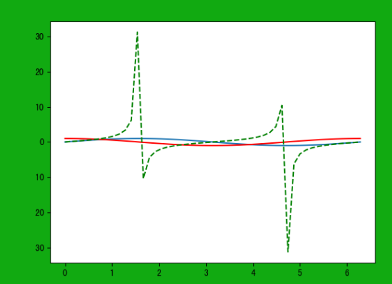
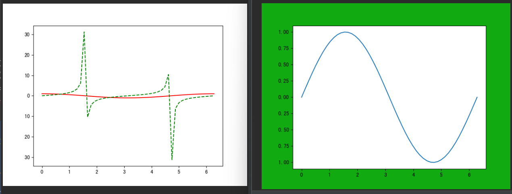
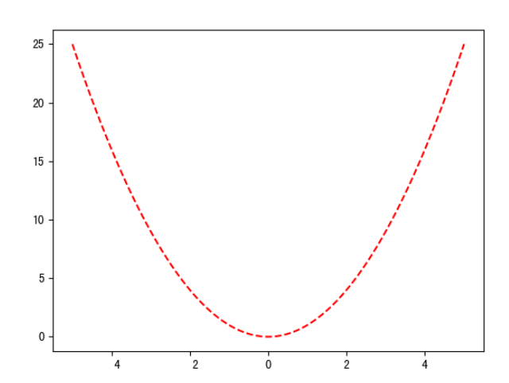
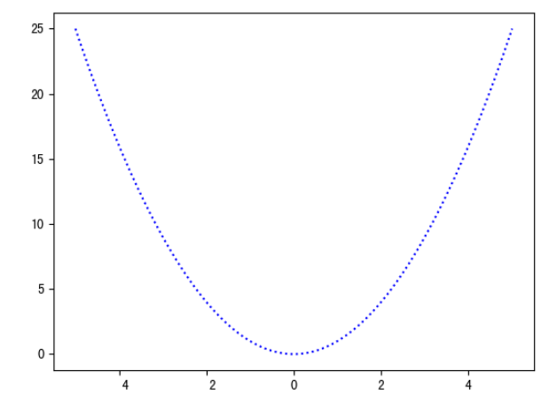

<a id="mulu">目录</a>
<a href="#mulu" class="back">回到目录</a>
<style>
    .back{width:40px;height:40px;display:inline-block;line-height:20px;font-size:20px;background-color:lightyellow;position: fixed;bottom:50px;right:50px;z-index:999;border:2px solid pink;opacity:0.3;transition:all 0.3s;color:green;}
    .back:hover{color:red;opacity:1}
    img{vertical-align:bottom;}
</style>

<!-- @import "[TOC]" {cmd="toc" depthFrom=3 depthTo=6 orderedList=false} -->

<!-- code_chunk_output -->

- [预先配置](#预先配置)
- [matplotlib画图的基本原理](#matplotlib画图的基本原理)
- [绘图函数参数](#绘图函数参数)
    - [颜色和线样式](#颜色和线样式)
- [画布配置](#画布配置)
- [绘图属性](#绘图属性)

<!-- /code_chunk_output -->

<!-- 打开侧边预览：f1->Markdown Preview Enhanced: open...
只有打开侧边预览时保存才自动更新目录 -->

```py
import numpy as np
import pandas as pd
import matplotlib.pyplot as plt
```
### 预先配置
- 查看自己电脑上的字体库
    ```py
    from matplotlib.font_manager import FontManager
    fm = FontManager()
    print(set(f.name for f in fm.ttflist))
    ```
- 让图片可以显示中文
    ```py
    plt.rcParams['font.sans-serif'] = ['SimHei']  # 此处字体应为上面电脑中有的字体
    ```
    如果需要下载字体以解决中文显示问题，可以参考[]
- 让图片可以显示负号
    ```py
    plt.rcParams['axes.unicode_minus'] = False
    ```
- [输出/保存矢量图](https://blog.csdn.net/sinat_39620217/article/details/119924912)
### matplotlib画图的基本原理
matplotlib的三层结构：
- **容器层**：最底部是画板层（多数情况下不需手动创建/更改），之上是画布层(figure)，最上方是绘图区（坐标系subplots），由两个坐标轴axes构成
- **辅助显示层**：坐标刻度、网格等使图像更方便看图的工具
- **图像层**：可以画各种各样的图表，设置图表颜色风格等等，这两层都运行在绘图区之上

常见的画图流程：
```py
# 可选：修改画布配置
plt.figure(figsize=(20,8),dpi=80)
# 必需：画图函数
plt.plot([1,2,3,4,5,6,7],[17,17,18,15,11,11,12])
# 可选：修改刻度、坐标轴标签，增加网格等等（辅助显示层）
plt.yticks(range(0,40,5))
# 可选：保存画图结果
plt.savefig("折线图1.png")
# 必需：展示图片（在pycharm中必需，ipynb中可省略）
plt.show()
```
注意：画图函数可以有多个，可以画在同一张图上；`plt.show()`是展示画的图片，同时清空画布和画布配置、重新开始画图，可以认为有几个show就画几张图
```py
x = np.linspace(0, 2*np.pi)
plt.figure(facecolor='#11aa11')
plt.plot(x, np.sin(x))
plt.plot(x, np.cos(x), 'r')
plt.plot(x, np.tan(x), 'g--')
plt.show()
```
{:width=300 height=300}
```py
x = np.linspace(0, 2*np.pi)
plt.figure(facecolor='#11aa11')
plt.plot(x, np.sin(x))
plt.show()
plt.plot(x, np.cos(x), 'r')
plt.plot(x, np.tan(x), 'g--')
plt.show()
```
{:width=300 height=300}
可以看到有两张图，第二张图中不继承第一张图的画布配置和绘图函数
### 绘图函数参数
以最基本的绘图函数`plt.plot()`为例，一般情况下需要传入两个参数，第一个是x值，第二个是y值
##### 颜色和线样式
- `color`或简写`c`：设定颜色，可以使用颜色的简写（b蓝色、g绿色、r红色、c青色、m品红、y黄色、k黑色、w白色...），也可以是颜色全称（orange橙色...），还可以是16进制颜色（`#11aa11`这种，但不能是`#fff`这种简写）
    注意：之后所有在plt中设置的关于颜色的取值都同上
- `linestyle`或简写`ls`：设定线的样式，可以取值--`'-'`实线（默认值）、`'--'`虚线、`'-.'`点虚线、`':'`点线...

```py
x = np.linspace(-5, 5, 100)  # 在-5至5的范围内取100个点
y = x**2  # y=x^2
plt.plot(x, y, c='red', ls='--')
plt.show()
```
{:width=300 height=300}
上面两个参数也合并到一起，如上面的`c='red', ls='--'`就可写成`'r--'`
```py
plt.plot(x, y, 'b:')
plt.show()
```
{:width=300 height=300}
### 画布配置
使用绘图函数作出的图都是在画布(figure)上展示的
使用函数`plt.figure()`可以更改画布的属性，参数：
- `figsize=(width, height)`设置画布宽高，一般情况下都是取小于10的整数
- `dpi=n`分辨率（像素密度），一般都是取整百的数，分辨率越大则图越大越清晰
- `facecolor=颜色`背景颜色

```py
x = np.linspace(0, 2*np.pi)
y = np.sin(x) # y=sin(x)
plt.figure(
    figsize=(3, 2),
    dpi=100,
    facecolor='#11aa11'
)
plt.plot(x, y)
plt.show()
```
{:width=300 height=300}
### 绘图属性
