<a id="mulu">目录</a>
<a href="#mulu" class="back">回到目录</a>
<style>
    .back{width:40px;height:40px;display:inline-block;line-height:20px;font-size:20px;background-color:lightyellow;position: fixed;bottom:50px;right:50px;z-index:999;border:2px solid pink;opacity:0.3;transition:all 0.3s;color:green;}
    .back:hover{color:red;opacity:1}
    img{vertical-align:bottom;}
</style>

<!-- @import "[TOC]" {cmd="toc" depthFrom=3 depthTo=6 orderedList=false} -->

<!-- code_chunk_output -->

- [matplotlib画图的基本原理和过程](#matplotlib画图的基本原理和过程)
    - [基本流程](#基本流程)
    - [预先配置](#预先配置)
    - [画布配置](#画布配置)
    - [保存图片](#保存图片)
- [多图布局](#多图布局)
    - [m行n列的子图](#m行n列的子图)
      - [subplot](#subplot)
      - [subplots](#subplots)
    - [图形嵌套](#图形嵌套)
      - [add_subplot](#add_subplot)
      - [axes和add_axes](#axes和add_axes)
    - [双轴显示](#双轴显示)
- [绘图函数参数--颜色和点线样式](#绘图函数参数-颜色和点线样式)
- [绘图属性](#绘图属性)
    - [图例](#图例)
    - [坐标轴刻度](#坐标轴刻度)
    - [坐标轴范围与形状](#坐标轴范围与形状)
    - [标题](#标题)
    - [网格线](#网格线)
    - [标签](#标签)
    - [文本](#文本)
    - [注释](#注释)
- [常用绘图函数](#常用绘图函数)
    - [折线图](#折线图)
    - [柱状图](#柱状图)
    - [直方图](#直方图)
    - [箱型图](#箱型图)
    - [散点图](#散点图)
    - [饼图](#饼图)
    - [面积图](#面积图)
    - [热力图](#热力图)
    - [极坐标图](#极坐标图)
    - [雷达图](#雷达图)
    - [等高线图](#等高线图)
      - [网格数据](#网格数据)
      - [等高线图](#等高线图-1)
    - [3D图](#3d图)
      - [三维折线图](#三维折线图)
      - [三维散点图](#三维散点图)
      - [三维柱形图](#三维柱形图)
- [对已有图进行处理](#对已有图进行处理)
- [综合案例](#综合案例)

<!-- /code_chunk_output -->

<!-- 打开侧边预览：f1->Markdown Preview Enhanced: open...
只有打开侧边预览时保存才自动更新目录 -->

写在前面：本笔记来自b站课程[千锋教育python数据分析教程200集](https://www.bilibili.com/video/BV15V4y1f7Ju)
[资料下载](https://pan.baidu.com/s/1yrr-kvH2PAR7zNI3K81WSA)  提取码：wusa

```py
import numpy as np
import pandas as pd
import matplotlib.pyplot as plt
```
### matplotlib画图的基本原理和过程
##### 基本流程
**matplotlib的三层结构**：
- **容器层**：最底部是画板层（多数情况下不需手动创建/更改），之上是画布层(figure)，最上方是绘图区（坐标系subplots），由两个坐标轴(axes)构成
- **辅助显示层**：坐标刻度、网格等使图像更方便看图的工具
- **图像层**：可以画各种各样的图表，设置图表颜色风格等等，这两层都运行在绘图区之上

常见的画图流程：
```py
# 可选：修改画布配置
plt.figure(figsize=(20,8),dpi=80)
# 必需：画图函数
plt.plot([1,2,3,4,5,6,7],[17,17,18,15,11,11,12])
# 可选：修改刻度、坐标轴标签，增加网格等等（辅助显示层）
plt.yticks(range(0,40,5))
# 可选：保存画图结果
plt.savefig("折线图1.png")
# 必需：展示图片（在pycharm中必需，ipynb中可省略）
plt.show()
```
注意：画图函数可以有多个，可以画在同一张图上；`plt.show()`是展示画的图片，同时清空画布和画布配置、重新开始画图，可以认为有几个show就画几张图
```py
x = np.linspace(0, 2*np.pi)
plt.figure(facecolor='#11aa11')
plt.plot(x, np.sin(x))
plt.plot(x, np.cos(x), 'r')
plt.plot(x, np.tan(x), 'g--')
plt.show()
```
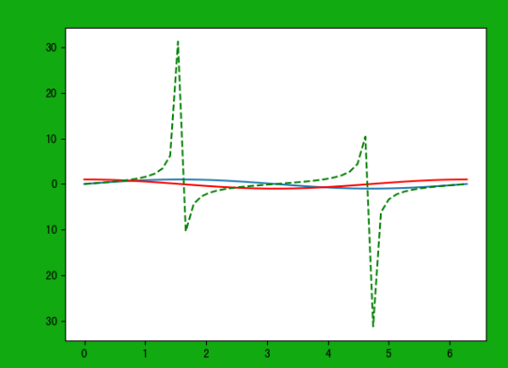{:width=300 height=300}
```py
x = np.linspace(0, 2*np.pi)
plt.figure(facecolor='#11aa11')
plt.plot(x, np.sin(x))
plt.show()
plt.plot(x, np.cos(x), 'r')
plt.plot(x, np.tan(x), 'g--')
plt.show()
```
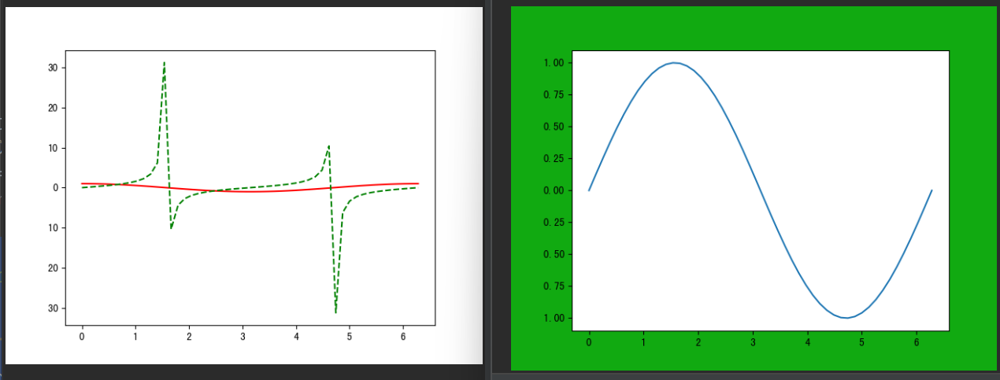{:width=300 height=300}
可以看到有两张图，第二张图中不继承第一张图的画布配置和绘图函数
##### 预先配置
- 查看自己电脑上的字体库
    ```py
    from matplotlib.font_manager import FontManager
    fm = FontManager()
    print(set(f.name for f in fm.ttflist))
    ```
- 让图片可以显示中文
    ```py
    plt.rcParams['font.sans-serif'] = ['SimHei']  # 此处字体应为上面电脑中已有的字体
    ```
    如果需要下载字体以解决中文显示问题，可以参考[字体文件下载地址](https://blog.csdn.net/qq_52558996/article/details/120277381)以及[安装方法](https://zhuanlan.zhihu.com/p/345605782)
- 让图片可以显示负号
    ```py
    plt.rcParams['axes.unicode_minus'] = False
    ```
##### 画布配置
使用绘图函数作出的图都是在画布(figure)上展示的
使用函数`plt.figure()`可以更改画布的属性，参数：
- `figsize=(width, height)`设置画布宽高，一般情况下都是取小于10的整数
- `dpi=n`分辨率（像素密度），一般都是取整百的数，分辨率越大则图越大越清晰
- `facecolor=颜色`背景颜色

```py
x = np.linspace(0, 2*np.pi)
y = np.sin(x) # y=sin(x)
plt.figure(
    figsize=(3, 2),
    dpi=100,
    facecolor='#11aa11'
)
plt.plot(x, y)
plt.show()
```
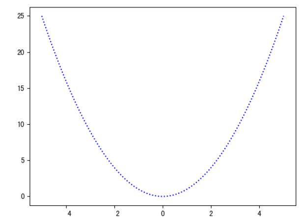{:width=300 height=300}
##### 保存图片
- 在画图函数后：`plt.savefig()`
- 在创建fig对象后，`fig.savefig()`

它们的参数：
- `fname`路径
- `dpi`像素密度
- `facecolor`图的背景颜色
- `pad_inches`内边距（图片边缘与图区域xy轴的距离）

注意`savefig`函数在保存图片时都不会清空画布，如果在保存图片后继续画图，得到的将是两个图的叠加
```py
fig = plt.figure(figsize=(8, 6))  # 创建画布对象
x = np.linspace(0, 2*np.pi)
plt.plot(x, np.sin(x))
plt.savefig("sinx.png")  # 注意该函数不会清空画布
plt.plot(x, np.cos(x))
fig.savefig(
    fname="sinx_cosx.png",  # 文件名
    dpi=100,  # 像素密度
    facecolor='pink',  # 背景颜色
    pad_inches=1  # 内边距
)
```
sinx.png：
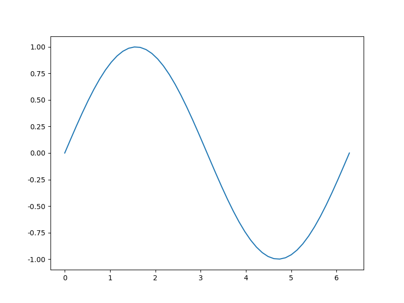{:width=300 height=300}
sinx_cosx.png：
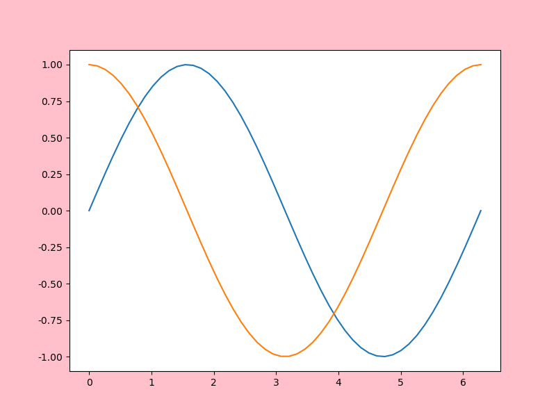{:width=300 height=300}

---

[输出/保存矢量图](https://blog.csdn.net/sinat_39620217/article/details/119924912)
### 多图布局
##### m行n列的子图
###### subplot
`子图对象=plt.subplot(三位整数)`
例如`ax1=plt.subplot(231)`就代表`ax1`是**2**行**3**列中的第**1**个图，也可以写成`subplot(2,3,1)`的形式
之后的画图都是对`ax1`进行操作
```py
fig = plt.figure(figsize=(8, 6))  # 创建画布
x = np.linspace(-np.pi, np.pi)
ax1 = plt.subplot(221)  # 第一个图
ax1.plot(x, np.abs(x))
ax1.set_title("子图1")
ax2 = plt.subplot(222)  # 第二个图
ax2.plot(x, x)
ax2.set_title("子图2")
ax3 = plt.subplot(2, 2, 3)  # 第三个图
ax3.plot(x, np.sin(x))
ax3.set_title("子图3")
ax4 = plt.subplot(2, 2, 4)  # 第四个图
ax4.plot(x, np.cos(x))
ax4.set_title("子图4")
fig.tight_layout()  # 使用紧凑布局
plt.show()
```
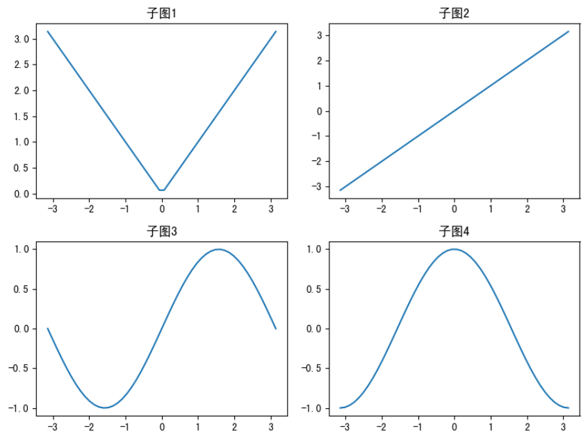{:width=400 height=400}
注意：`ax1=plt.subplot(231)`实际是先把画布分成3x2个格子（每行都有3个格子，共2行），之后让`ax1`进入第一个格子
这就是说，虽然我们指定了2行3列布局，也可以只画<6个图，多余的位置为空白
```py
fig = plt.figure(figsize=(8, 6))
x = np.linspace(-np.pi, np.pi)
ax1 = plt.subplot(221)  # 第一个图
ax1.plot(x, np.abs(x))
ax1.set_title("子图1")
ax2 = plt.subplot(222)  # 第二个图
ax2.plot(x, x)
ax2.set_title("子图2")
ax3 = plt.subplot(2, 2, 3)  # 第三个图
ax3.plot(x, np.sin(x))
ax3.set_title("子图3")
fig.tight_layout()
plt.show()
```
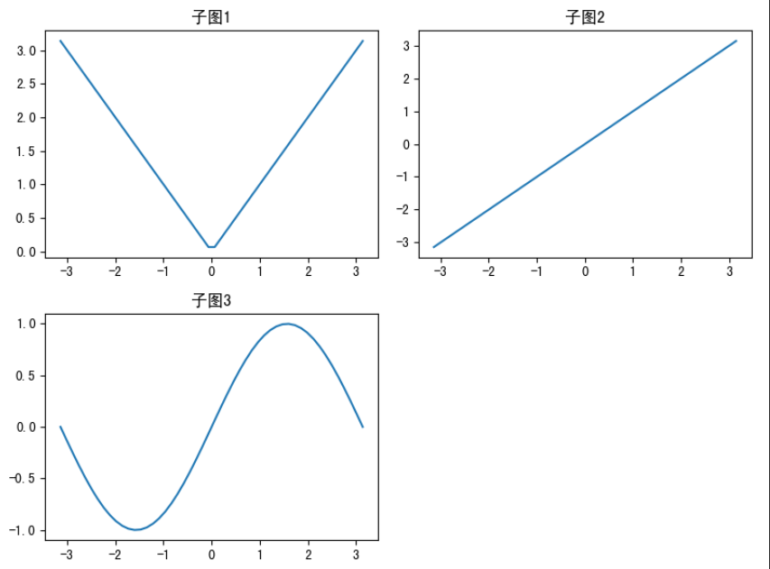{:width=400 height=400}
特殊情况：让第二行只画一个图，且占满全部的行
第一行的两个图不变，然后把画布分成1x2个格子，即两行一列，让第三个图进入第2个格子（第2行）：`subplot(2, 1, 1)`
```py
fig = plt.figure(figsize=(8, 6))
x = np.linspace(-np.pi, np.pi)
ax1 = plt.subplot(221)  # 第一个图
ax1.plot(x, np.abs(x))
ax1.set_title("子图1")
ax2 = plt.subplot(222)  # 第二个图
ax2.plot(x, x)
ax2.set_title("子图2")
ax3 = plt.subplot(2, 1, 2)  # 第三个图
ax3.plot(x, np.sin(x))
ax3.set_title("子图3")
fig.tight_layout()
plt.show()
```
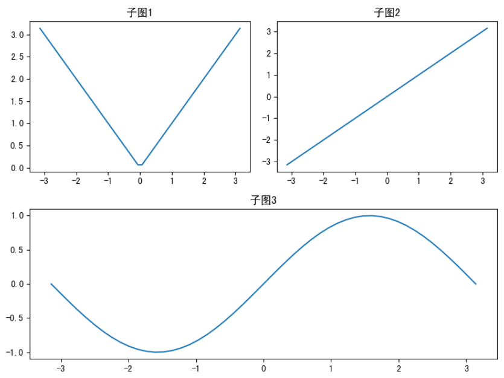{:width=400 height=400}
###### subplots
`subplots(m,n)`创建m行n列的画布格子，返回一个二元组，分别是画布对象fig和一个m行n列的二维列表，元素为子图对象
接收方式：
```py
fig, ax = plt.subplots(2, 2)
ax1, ax2 = ax  # ax1表示第一行的两个图，ax2表示第二行的两个图
ax11, ax12 = ax1  # ax11表示第一行的第一个图，ax12表示第一行的第二个图
ax21, ax22 = ax2  # ax21表示第二行的第一个图，ax22表示第二行的第二个图
```
ax11/12/21/22的使用方式同[subplot](#subplot)
例：
```py
fig, ax = plt.subplots(2, 2)
ax1, ax2 = ax
ax11, ax12 = ax1
ax21, ax22 = ax2
fig.set_figwidth(8)
fig.set_figheight(6)  # 设置画布宽高，相当于plt.figure(figsize=(8, 6))
x = np.linspace(-np.pi, np.pi)
ax11.plot(x, np.abs(x))
ax11.set_title("子图11")
ax12.plot(x, x)
ax12.set_title("子图12")
ax21.plot(x, np.sin(x))
ax21.set_title("子图21")
ax22.plot(x, np.cos(x))
ax22.set_title("子图22")
fig.tight_layout()  # 使用紧凑布局
plt.show()
```
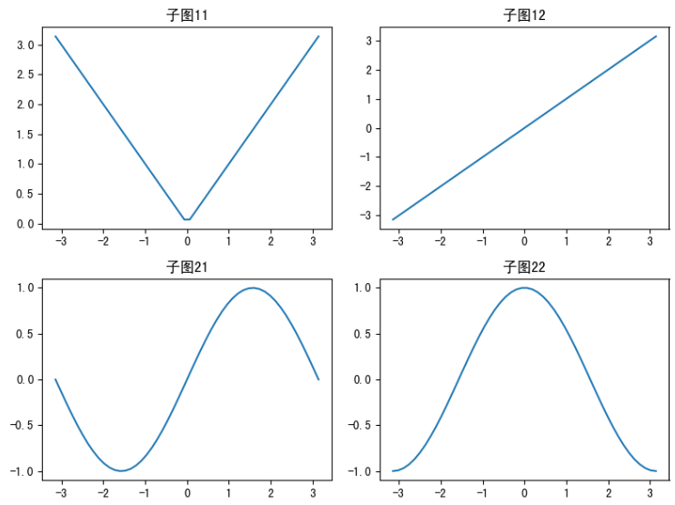{:width=400 height=400}
##### 图形嵌套
###### add_subplot
`子图对象=fig.add_subplot()`用于向已有图中叠加新图
传入参数与[subplot](#subplot)类似，都是接收一个三位数/3个整数，其实就是把已有的图当成了画布，再画新的子图
```py
x = np.linspace(-np.pi, np.pi)
fig = plt.figure()  # 创建画布对象
plt.plot(x, x)  # 已有图
ax = fig.add_subplot(221)  # 在2x2格子的第一个位置（左上角）
ax.plot(x, np.sin(x))  # 嵌套图
plt.show()
```
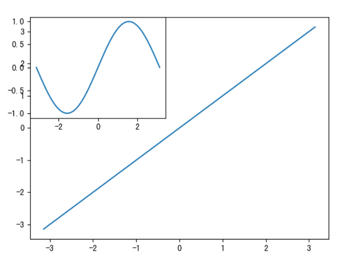{:width=400 height=400}
###### axes和add_axes
`子图对象=plt.axes([left, bottom, width, height])`
`子图对象=fig.add_axes([left, bottom, width, height])`
- left和bottom为图距已有图左/下方的距离百分比
- width和height为新图的宽高占已有图的百分比

```py
x = np.linspace(-np.pi, np.pi)
fig = plt.figure(figsize=(8, 6))  # 创建画布对象
plt.plot(x, -np.sin(x))  # 已有图
ax1 = plt.axes([0.18, 0.18, 0.3, 0.3])
ax1.plot(x, -x)  # 嵌套图1
ax2 = fig.add_axes([0.52, 0.52, 0.3, 0.3])
ax2.plot(x, x)  # 嵌套图2
plt.show()
```
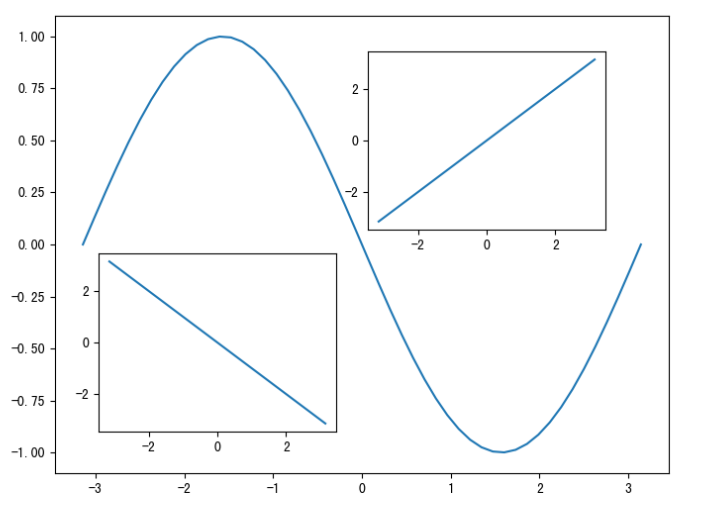{:width=400 height=400}
##### 双轴显示
使用场景：两条线共享x轴，但分别使用不同的y轴（左侧和右侧y轴）
方法：
```
子图对象1 = plt.gca()  # 获得当前xy轴轴域
子图对象2 = 子图对象1.twinx()  # 和子图对象1共享x轴
```
具体例子：
```py
x = np.linspace(-np.pi, np.pi)
ax1 = plt.gca()  # 第一个图
ax1.plot(x, np.exp(x), c='r')  # 画第一个图
ax1.set_xlabel('time')
ax1.set_ylabel('exp', color='r')  # 设置图1的xy轴标签
ax1.tick_params(axis='y', colors='red')  # 更改图1的y轴颜色
ax2 = ax1.twinx()  # 第二个图
ax2.plot(x, np.sin(x), c='b')  # 画第二个图
ax2.set_ylabel('sin', color='b')  # 设置图2的xy轴标签
ax2.tick_params(axis='y', colors='blue')  # 更改图2的y轴颜色
plt.tight_layout()  # 使用紧凑布局
plt.show()
```
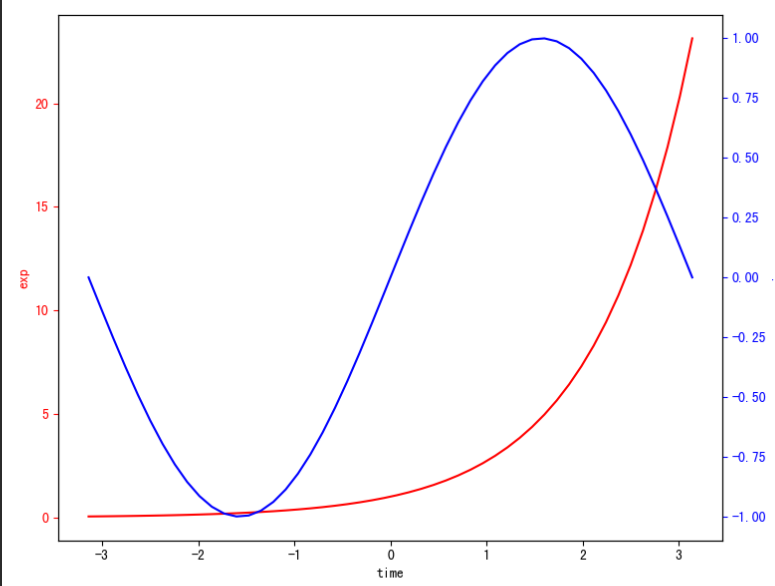{:width=300 height=300}
### 绘图函数参数--颜色和点线样式
以最基本的绘图函数`plt.plot()`为例，一般情况下必须传入两个参数，第一个是x值，第二个是y值。如果只传入一组数据，则会作为y轴的值，x轴值为该数据的索引（默认0~n）
**颜色和点线样式参数**：
- `color`或简写`c`：设定颜色，可以使用颜色的简写（b蓝色、g绿色、r红色、c青色、m品红、y黄色、k黑色、w白色...），也可以是颜色全称（orange橙色...），还可以是16进制颜色（`#11aa11`这种，但不能是`#fff`这种简写）
    注意：之后所有在plt中设置的关于颜色的取值都同上
- `linestyle`或简写`ls`：设定线的样式，可以取值--`'-'`实线（默认值）、`'--'`虚线、`'-.'`点虚线、`':'`点线...
    ```py
    x = np.linspace(-5, 5, 100)  # 在-5至5的范围内取100个点
    y = x**2  # y=x^2
    plt.plot(x, y, c='red', ls='--')
    plt.show()
    ```
    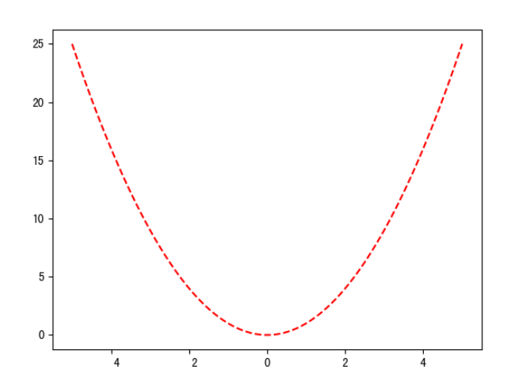{:width=300 height=300}
    上面两个参数也合并到一起，如上面的`c='red', ls='--'`就可写成`'r--'`
    ```py
    plt.plot(x, y, 'b:')
    plt.show()
    ```
    {:width=300 height=300}
- `marker`标记，即数据点形状，[更多marker](https://www.cnblogs.com/Big-Big-Watermelon/p/14052165.html)
    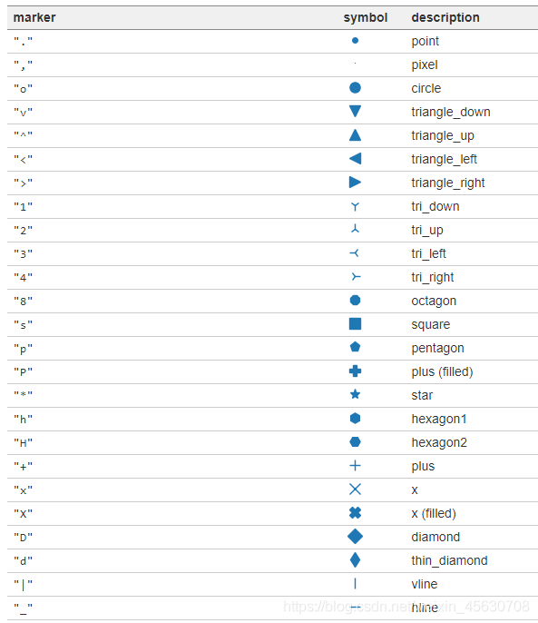{:width=600 height=600}
  - `markersize`数据点大小，取值为一个整数
  - `mfc`(marker face color)标记的背景颜色，可以理解为数据点的填充色
  - `markeredgecolor`数据点边框颜色
  - `markeredgewidth`数据点边框宽度，取值为一个整数
  - 注意：`color`是线的颜色，点的颜色都用`marker`设置
- `linewidth`或简写`lw`：线宽度
- `alpha`线透明度
    ```py
    x = np.linspace(-np.pi, np.pi)
    plt.plot(
        x, np.sin(x),  # 数据
        c='r',  # 线颜色为红色
        ls='-',  # 实线
        lw=2,  # 线宽度
        alpha=0.5,  # 透明度
        marker='*',  # 标记点形状
        markersize=10,  # 数据点大小
        mfc='black',  # 点填充色为黑色
        markeredgecolor='g',  # 数据点边框色为绿色
        markeredgewidth=2,  # 数据点边框宽度
    )
    plt.show()
    ```
    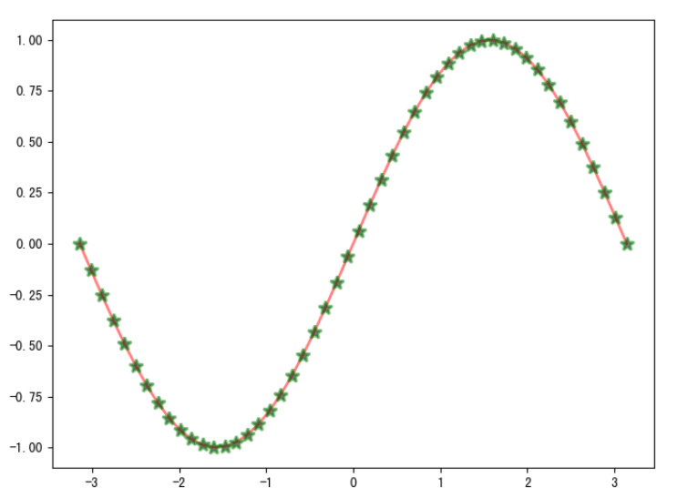{:width=300 height=300}
- `label=线名称`标签，即给线命名，常配合`plt.legend()`使用以创建图例
    ```py
    x = np.linspace(-np.pi, np.pi)
    plt.plot(x, np.sin(x), label='sin')
    plt.plot(x, np.cos(x), label='cos')
    plt.legend()
    plt.show()
    ```
    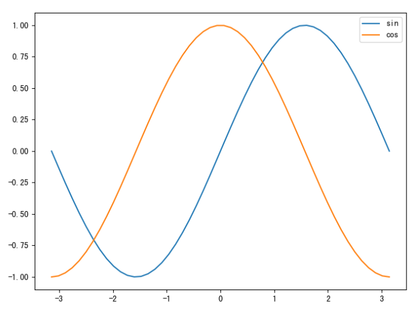{:width=300 height=300}

其它参数将在[常用绘图函数](#常用绘图函数)中具体结合绘图函数介绍
### 绘图属性
即使用其它绘图辅助函数，在基本图的基础上添加某些部分，属于[辅助显示层](#基本流程)
##### 图例
通常用于一张图中画多条线的情况
`图对象.legend([标签1, 标签2, ...])`
- 图对象可以是`plt`，也可以前面提过的子图对象`ax`，以下都以`plt`表示图对象
- 标签列表是必须参数，第几个标签对应着之前使用绘图函数画出的第几个图
- 其它常用参数：
  - `fontsize`字号
  - `loc`位置，默认值为`best`即自动寻找最佳位置（空白处），也可以是`upper right`右上方、`lower left`左下、`right`右、`center`中间等值
  - `ncol`显示成几列，默认为1列
- [更多参数](https://blog.csdn.net/mighty13/article/details/113820798)

```py
x = np.linspace(-np.pi, np.pi)
plt.plot(x, np.sin(x))
plt.plot(x, np.cos(x))
plt.legend(
    ['sin', 'cos'],
    loc='center right',
    ncol=2,
    fontsize=12
)
plt.show()
```
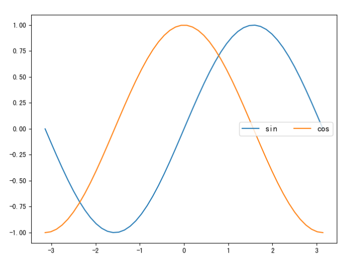{:width=300 height=300}
##### 坐标轴刻度
`plt.xticks(ticks=列表)`和`plt.yticks(ticks=列表)`列表中元素为具体的刻度值，`ticks=`可省略
```py
x = np.linspace(0, 2*np.pi)
plt.plot(x, np.sin(x))
plt.xticks(np.arange(0, 8, 1))
plt.yticks([-1, 0, 1])
plt.show()
```
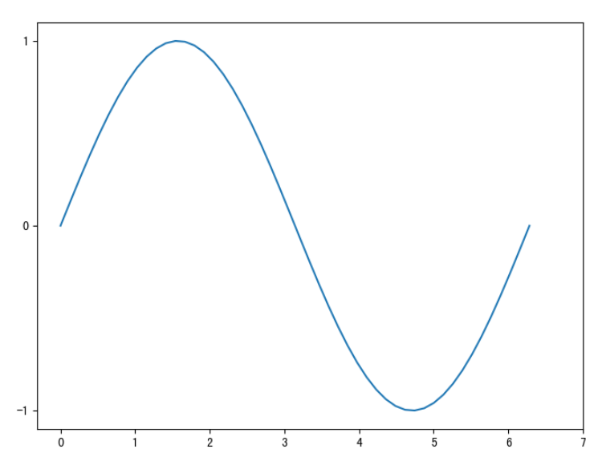{:width=300 height=300}
其它参数：
- `fontsize`字号
- `color`或简写`c`颜色（刻度标签字的颜色）
- `labels=列表`是实际显示的刻度标签，默认与`ticks`相同（按照`ticks`画图，但显示`labels`）。如果想使用非数值型数据作刻度标签，就设置该属性
- `ha`水平对齐方式，可取值`right`靠右（默认）、`left`靠左、`center`居中
- [关于标签位置的更多参数](https://developer.baidu.com/article/details/2797520)

```py
x = np.linspace(0, 2*np.pi)
plt.plot(x, np.sin(x))
plt.xticks(
    np.arange(0, 8, 1),
    fontsize=20,
    color='r'
)
plt.yticks(
    [-1, 0, 1],
    labels=['min', '0', 'max'],
    ha='left'
)
plt.show()
```
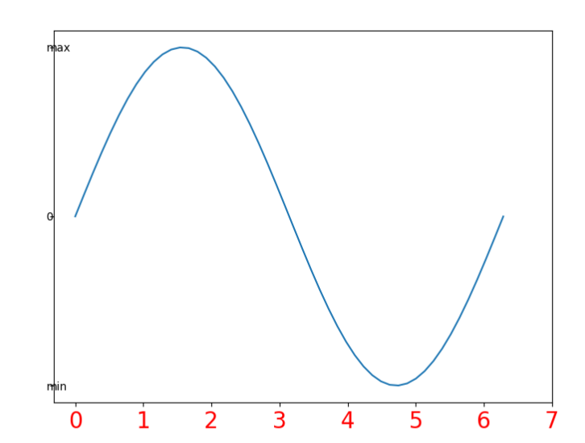{:width=300 height=300}
##### 坐标轴范围与形状
两种较简单的方法
- `plt.xlim(min, max)`和`plt.ylim(min, max)`
- `plt.axis([xmin, xmax, ymin, ymax])`

min/max指对应坐标轴的最大最小值

```py
x = np.linspace(0, 2*np.pi)
plt.plot(x, np.sin(x))
plt.xlim(-2, 8)
plt.ylim(-2, 2)
# 或者：
# plt.axis([-2, 8, -2, 2])
plt.show()
```
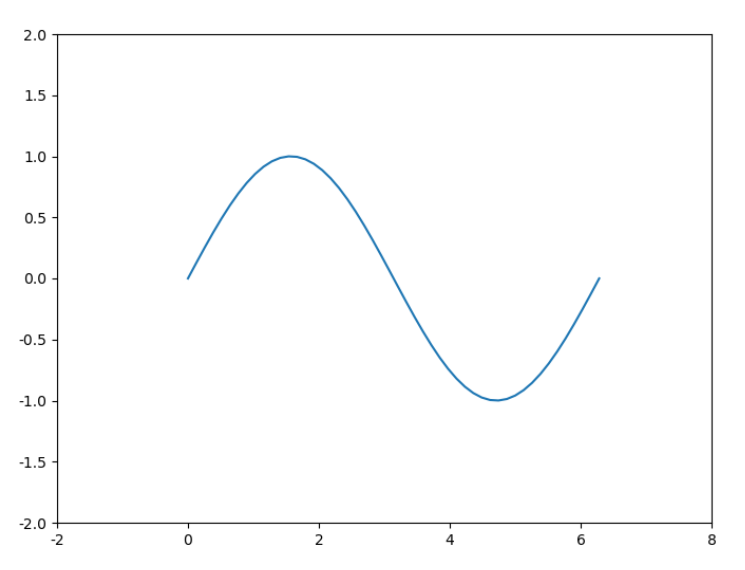{:width=300 height=300}

---

`plt.axis()`函数的其它取值（用于指定坐标轴的其它样式）
- `'on'`默认值，显示坐标轴且自动判断范围
- `'off'`不显示坐标轴
- `'equal'`使xy轴每个刻度的间距相等
- `'scaled'`自动缩放坐标轴与图片匹配
- `'tight'`与`'scaled'`类似，更美观紧凑
- `'square'`自动延长x/y轴，使最后的结果图为一个正方形（x/y轴宽高相等）

```py
x = np.linspace(0, 2*np.pi)
type = ['on', 'off', 'equal', 'scaled', 'tight', 'square']
for i in range(6):
    ax = plt.subplot(2, 3, i+1)
    ax.plot(x, np.sin(x))
    ax.axis(type[i])
    ax.set_title(f"'{type[i]}'")
plt.show()
```
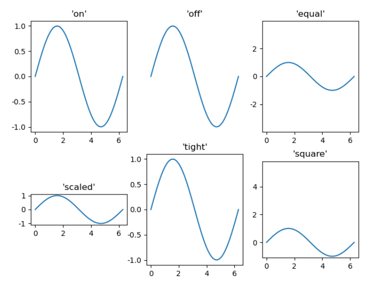{:width=400 height=400}
##### 标题
`plt.title(标题)`主标题
`plt.subtitle(父标题)`父标题
其它参数：
- `fontsize`字号
- `color`或简写`c`颜色
- `loc`位置，可以取值`'center'`居中（默认）、`'left'`靠左、`'right'`靠右
- `x`和`y`具体在xy轴上的位置

```py
x = np.linspace(0, 2*np.pi)
plt.plot(x, np.sin(x))
plt.title(
    "title",
    fontsize=20,
    loc='left'
)
plt.suptitle(
    "suptitle",
    x=0.5,
    y=0.95
)
plt.show()
```
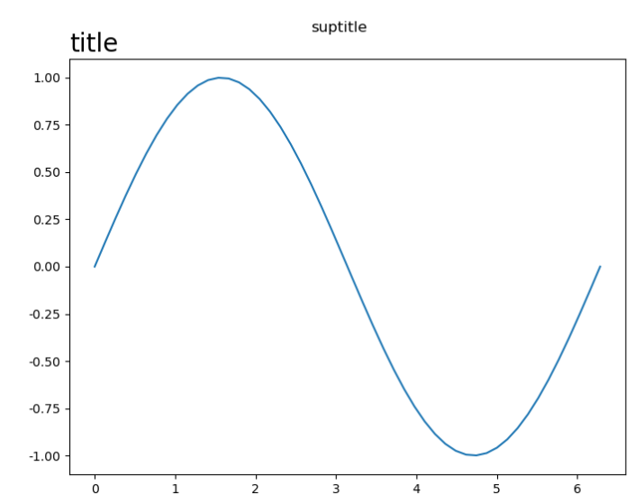{:width=300 height=300}
##### 网格线
`plt.grid()`
参数：
- 因为网格线也是一种线，它具有[绘图函数中的线样式参数](#绘图函数参数-颜色和点线样式)，如ls、lw、color等
- `axis='x'/'y'/'xy'`让哪个轴显示网格线，默认为`'xy'`都显示

```py
x = np.linspace(0, 2*np.pi)
plt.plot(x, np.sin(x))
plt.grid(
    axis='x',  # 指定x网格线样式
    ls='--'
)
plt.grid(
    axis='y',  # 指定y网格线样式
    lw=0.5,
    c='red'
)
plt.show()
```
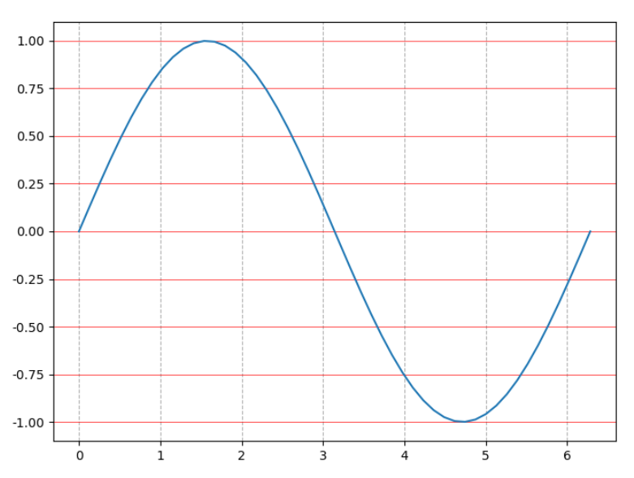{:width=300 height=300}
##### 标签
`plt.xlabel(x轴标签)`和`plt.ylabel(x轴标签)`
其它参数如fontsize、color、ha等与前述类似
```py
x = np.linspace(0, 2*np.pi)
plt.plot(x, np.sin(x))
plt.xlabel(
    "x",
    fontsize=18,  # 字体
    color='r',  # 颜色
    x=1  # 在x轴上的位置
)
plt.ylabel(
    "y=sin(x)",
    fontsize=18,
    color='y',
    y=1,  # 在y轴上的位置
    rotation=0  # 设置标签旋转角度使其平行于x轴，默认为90垂直于x轴
)
plt.show()
```
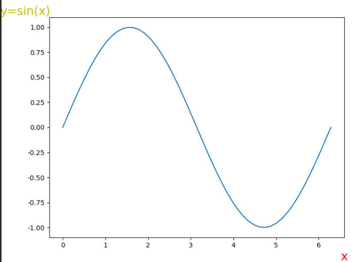{:width=300 height=300}
##### 文本
即在图上写文字
`plt.text(x, y, s)`在指定坐标(x,y)标注字符串s，注意这里的xy不再是占xy轴的百分比，而是真实的坐标
其它参数如fontsize、color、ha等与前述类似
```py
x = np.linspace(0, 2*np.pi)
plt.plot(x, np.sin(x))
plt.text(
    x=5,
    y=0.8,
    s="y=sin(x)",
    color='r',
    fontsize=20
)
plt.show()
```
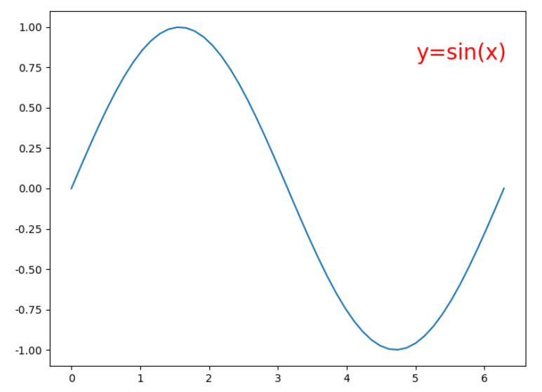{:width=300 height=300}
一个更复杂的例子：标注折线图上每个点的坐标
```py
x = range(10)
y = [10, 30, 50, 20, 40, 90, 100, 20, 70, 80]
plt.plot(x, y, 'r--', marker='o')
for x_pos, y_pos in zip(x, y):  # zip函数将xy数组相同位置上的元素合并成一个二元组
    # x_pos和y_pos分别为每个点xy坐标
    plt.text(
        x=x_pos,
        y=y_pos,  # 避免点与文字重叠
        s=f"({x_pos},{y_pos})",
        color='b',
        fontsize=16,
        ha='center',  # 水平对齐方式，使坐标在点上方显示
        va='bottom'  # 垂直对齐方式，使文字显示在点上方
    )
plt.show()
```
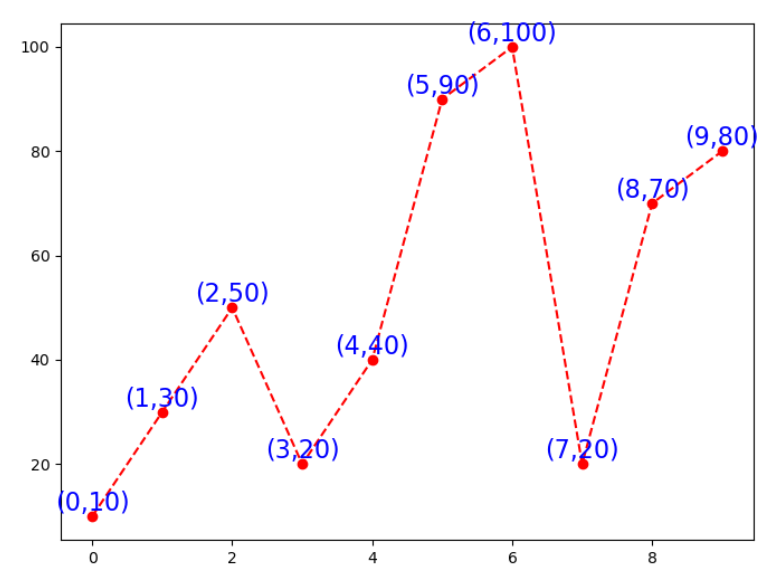{:width=300 height=300}
##### 注释
与[文本](#文本)类似，不同的是它可以对指定的点标注，而不是简单的在某个位置写文字
`plt.annotate()`
- `text`标注内容
- `xy`要标注的坐标点，值为一个二元组，分别为xy轴坐标
- `xytext`文本的位置，值页为一个二元组，分别为xy轴坐标
- 其它文本属性这里不再说明
- `arrowprops`箭头样式，值为一个字典，键值分别为箭头属性和其值
  - `width`箭头线的宽度
  - `headwidth`箭头头部尖尖的宽度
  - `color`箭头颜色
  - `facecolor`箭头的填充色
  - `edgecolor`箭头的边框色

```py
x = range(10)
y = [10, 30, 50, 20, 40, 90, 100, 20, 70, 80]
plt.plot(x, y, 'r--', marker='o')
plt.annotate(
    s='max_value',  # 文字
    xy=(x[np.argmax(y)]-0.2, max(y)),  # 箭头指向位置（为避免箭头覆盖点，错开一点）
    xytext=(x[np.argmax(y)]-4, max(y)-10),  # 文字位置
    color='blue',  # 颜色
    fontsize=16,  # 字号
    arrowprops={
        'width': 2,  # 箭头线宽度
        'headwidth': 8,  # 箭头尖宽度
        'facecolor': 'yellow',  # 填充色
        'edgecolor': 'green'  # 边框色
    }
)
plt.show()
```
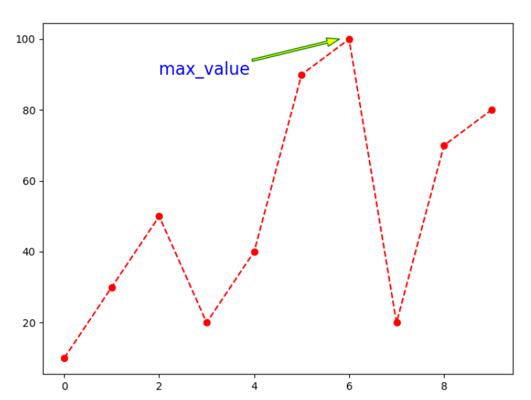{:width=300 height=300}
### 常用绘图函数
##### 折线图
[颜色和点线样式](#绘图函数参数-颜色和点线样式)和[绘图属性](#绘图属性)已经介绍过折线图的常用参数和画法，这里不再重复说明
**例：从excel中读取数据并绘制折线图**
数据结构：
```
   月份   语文   数学  英语
0  1月   96   81  97
1  2月  100   73  99
2  3月   62  100  67
3  4月   63  100  84
4  5月   71   82  92
```
绘制三条线，横坐标为月份，纵坐标为语文、数学、英语成绩
```py
data = pd.read_excel('data/plt/plot.xlsx', sheet_name='line')  # 读取数据
color_list = list('gbr')  # 线的颜色列表
ls_list = ['--', '-', ':']  # 线的形状列表
marker_list = ['*', 'o', '>']  # 点的形状列表
mfc_list = list('rgb')  # 点的填充颜色列表
x = data.月份  # 取月份作为x轴值
for i in range(data.shape[1]-1):  # 遍历其余所有列作y轴值
    y = data.iloc[:, i+1]  # 取成绩列作y轴值
    plt.plot(
        x, y,  # 数据
        f'{color_list[i]}{ls_list[i]}',  # 线样式
        label=y.name,  # 名称（用于创建图例）
        marker=marker_list[i],  # 点样式
        mfc=mfc_list[i],  # 填充颜色
        ms=10,  # 点大小
        alpha=0.6  # 透明度
    )
plt.legend()  # 设置图例
plt.yticks(range(0, 120, 10))  # y轴刻度
plt.xlabel("月份")  # x轴标签
plt.ylabel("成绩")  # y轴标签
plt.title("成绩变化趋势")  # 标题
plt.grid(axis='y', ls='--', alpha=0.2)  # 网格线
plt.show()
```
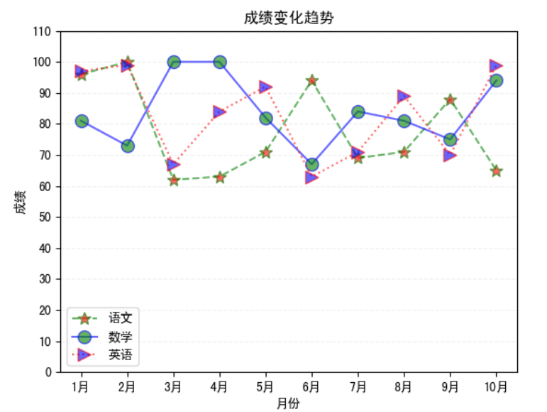{:width=300 height=300}
##### 柱状图
`plt.bar(x, y, width)`必须传入两个参数，分别是xy轴值，`width`是柱子的宽度，一般取0-1间的值
例：
```
     年份      销售额
0  2014  1962035
1  2015  2838693
2  2016  2317447
3  2017  2335002
4  2018  2438570
```
```py
data = pd.read_excel('data/plt/plot.xlsx', sheet_name='bar1')  # 读取数据
x, y = data.年份, data.销售额  # xy轴数据
plt.bar(x, y)  # 画柱状图
plt.title("年份--销售额")  # 标题
plt.xlabel("年份")  # x轴标签
plt.ylabel("销售额")  # y轴标签
for a, b in zip(x, y):  # ab分别对应xy的元素
    plt.text(x=a, y=b+0.05*(10**6), s='{:.1f}万'.format(b/10000), ha='center')  # 柱子上方显示销售额（以万为单位，保留一位小数）
plt.show()
```
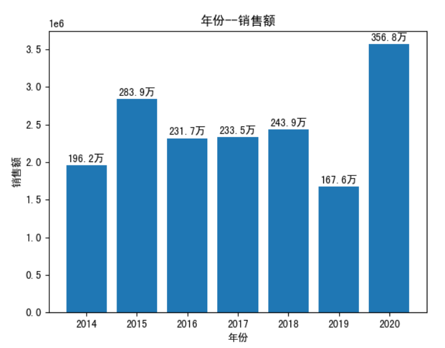{:width=300 height=300}
y轴上边的`1e6`表示y轴单位为10的6次方

---

**同时画多个柱子（簇状柱状图）**：使用多个`plt.bar(x, y)`，但调整x的位置，使多个柱子错开，避免重叠
例：
```
    年份    北区    中区     南区
0  2014   634704  534917   792414
1  2015  1218844  746554   873295
2  2016  1013322  904058   400067
3  2017  1068521   12269  1254212
4  2018   419352  526985  1492233
```
```py
data = pd.read_excel('data/plt/plot.xlsx', sheet_name='bar2')  # 读取数据
plt.title("年份--销售额")  # 标题
plt.xlabel("年份")  # x轴标签
plt.ylabel("销售额")  # y轴标签
width = 0.2  # 每个柱子的宽度
x = data.年份  # x轴数据
plt.bar(x-width, data.北区, width=width, label='北区')  # 画柱状图1
plt.bar(x, data.中区, width=width, label='中区')  # 画柱状图2
plt.bar(x+width, data.南区, width=width, label='南区')  # 画柱状图3
plt.legend()  # 显示图例
plt.show()
```
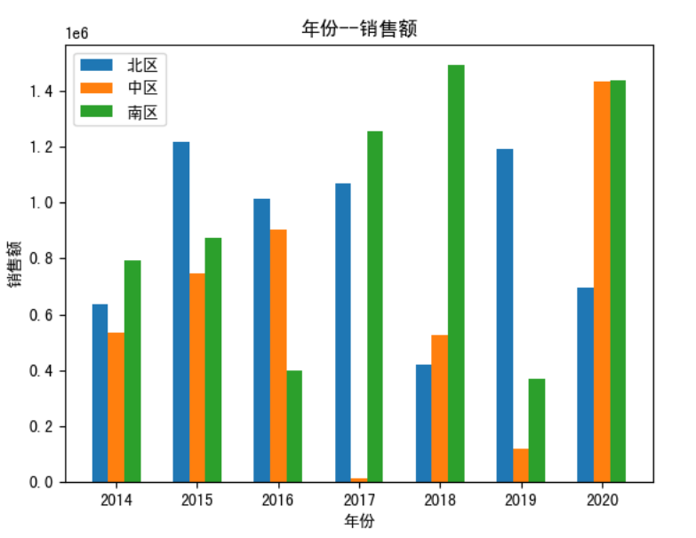{:width=300 height=300}

---

**堆叠柱状图**：使用多个`plt.bar(x, y)`，设置参数`bottom`调整每个柱子底部的位置，如第二个柱子的底部位置应为第一个柱子的y（顶部位置）
仍使用上面的数据：
```py
data = pd.read_excel('data/plt/plot.xlsx', sheet_name='bar2')  # 读取数据
plt.title("年份--销售额")  # 标题
plt.xlabel("年份")  # x轴标签
plt.ylabel("销售额")  # y轴标签
x = data.年份  # x轴数据
plt.bar(x, data.北区, label='北区')  # 画柱状图1
plt.bar(x, data.中区, label='中区', bottom=data.北区)  # 画柱状图2，底部位置为图1的y值
plt.bar(x, data.南区, label='南区', bottom=data.北区+data.中区)  # 画柱状图3，底部位置为图1+图2的y值
plt.legend()  # 显示图例
plt.show()
```
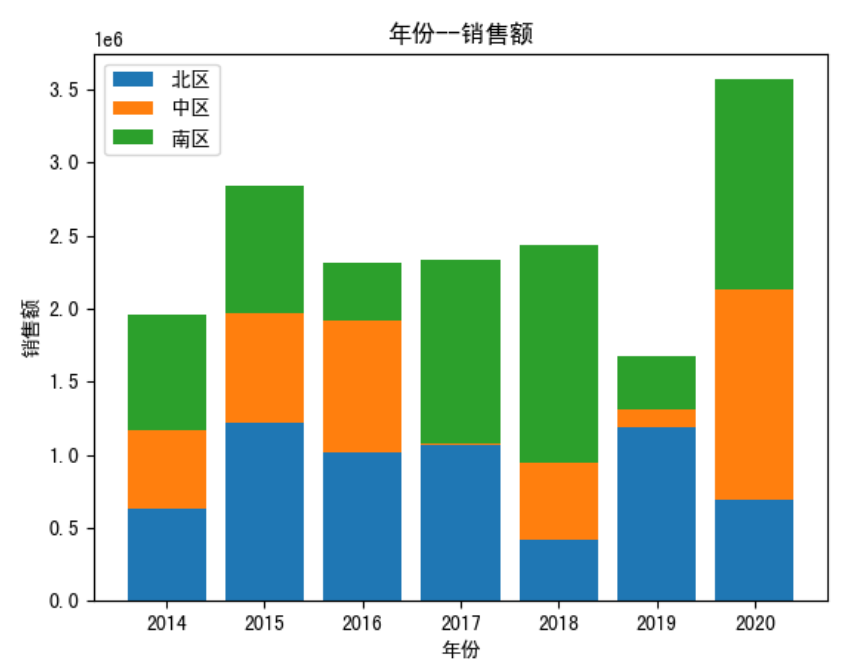{:width=300 height=300}

---

**水平方向的柱状图（条形图）**：`plt.barh(x, y)`，参数设置与柱状图类似，堆叠/簇状图的绘制思路也相同，区别是
- `width`属性变成了`height`，仍表示柱子宽度
- 堆叠条形图修改的是`left`而不是`bottom`
##### 直方图
也称质量分布图，主要用于概率分布，可以表示出数据的频数或频率，各柱子间无间距
`plt.hist(x)`只需传入一组数据，横轴表示数据有几种取值，纵轴表示每个值出现的次数/概率
```py
x = np.random.randint(0, 10, 100)  # 在0-9范围内生成100个随机数
plt.hist(x)
plt.xticks(range(10))  # 调整x轴刻度
plt.show()
print(pd.Series(x).value_counts())  # 每个数出现的次数
```
```
2    15
4    13
7    10
6    10
5    10
9     9
1     9
0     9
3     8
8     7
dtype: int64
```
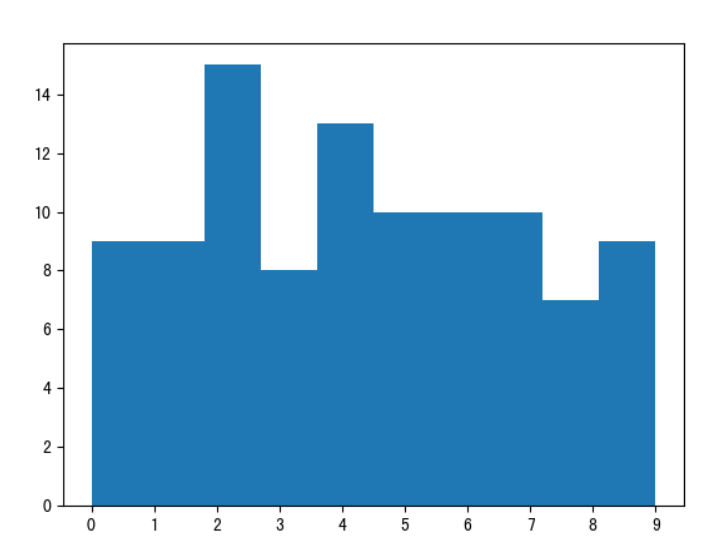{:width=300 height=300}
可以看到2出现15次，4出现14次...，与直方图相对应（2的高度为15，4的高度为14...）

---

**指定分组方式**：`bins`参数，默认一个值为1组
- 可以是一个整数，表示分成几组
  ```py
  x = np.random.randint(0, 10, 100)  # 在0-9范围内生成100个随机数
  plt.hist(x, bins=5)  # 分成5组
  plt.show()
  ```
  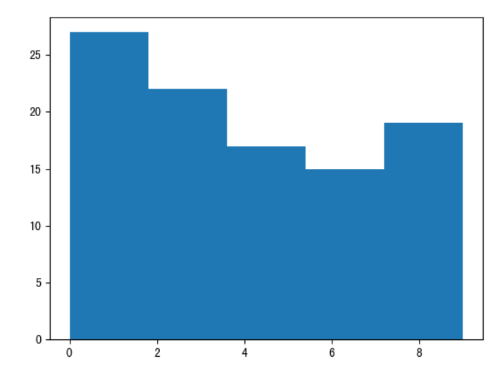{:width=300 height=300}
- 也可以是一个数组，每个元素为组的分界线，左闭右开区间
  ```py
  x = np.random.randint(0, 10, 100)  # 在0-9范围内生成100个随机数
  plt.hist(x, bins=[0, 4, 8, 10])  # 分组方式：[0,4) [4,8) [8,10)
  plt.show()
  ```
  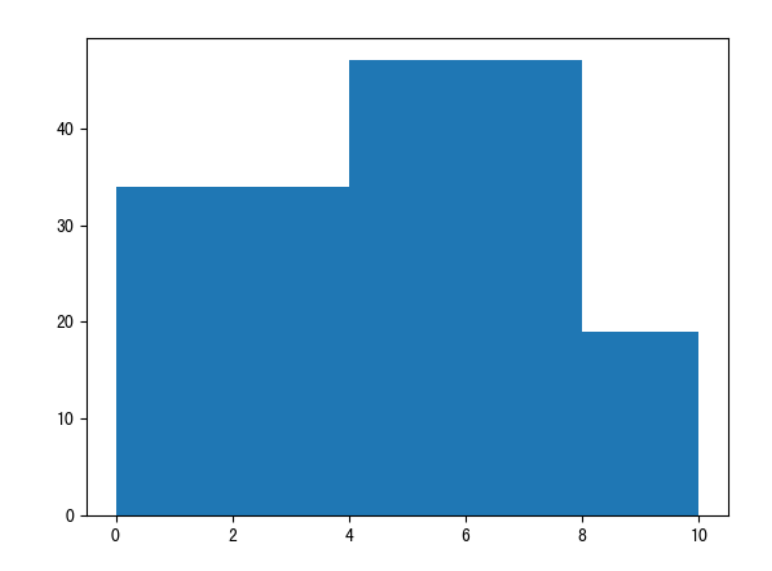{:width=300 height=300}

---

**显示频率而不是频数**：`plt.hist(x, density=True)`
```py
x = np.random.randint(0, 10, 100)  # 在0-9范围内生成100个随机数
plt.hist(x, bins=5, density=True)  # 分成5组，显示频率
plt.show()
```
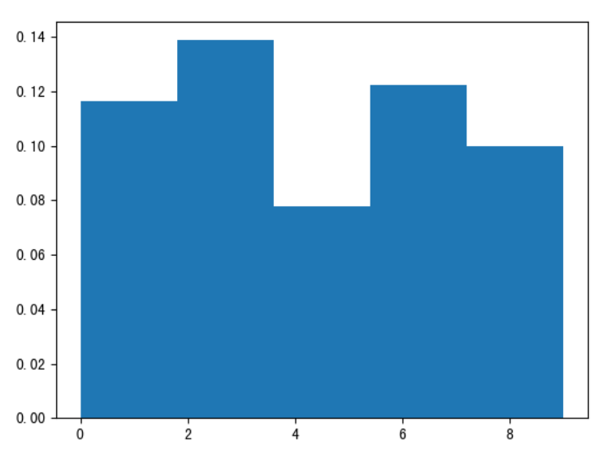{:width=300 height=300}

---

例：统计分数的分布情况，每10分为一组
```py
data = pd.read_excel('data/plt/plot.xlsx', sheet_name='hist')  # 读取数据
x = data.分数  # 数据
plt.hist(
    x,
    bins=range(min(x)//10*10, max(x)//10*10+20, 10),  # 分组方式：最低分数取整10--最高分数取整10，间隔为10
    facecolor='pink',  # 柱子颜色
    edgecolor='red',  # 边框颜色
    alpha=0.5  # 透明度
)
plt.show()
```
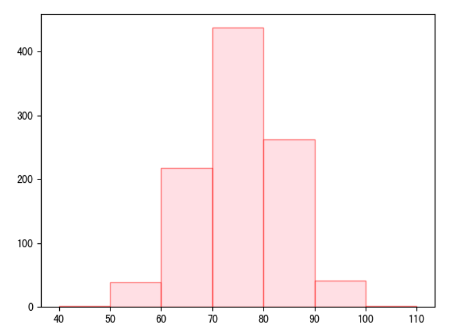{:width=300 height=300}
如果想在每个柱子上显示频数：[参考文章](https://blog.csdn.net/qq_38532494/article/details/114094714)
```py
data = pd.read_excel('data/plt/plot.xlsx', sheet_name='hist')  # 读取数据
x = data.分数  # 数据
hist = plt.hist(
    x,
    bins=range(min(x)//10*10, max(x)//10*10+20, 10),  # 分组方式：最低分数取整10--最高分数取整10，间隔为10
    facecolor='pink',  # 柱子颜色
    edgecolor='red',  # 边框颜色
    alpha=0.5  # 透明度
)
interval = 10  # 分组间隔
for i in range(len(hist[0])):
    plt.annotate(
        s=int(hist[0][i]),
        xy=(hist[1][i] + interval / 3, hist[0][i]+5),
        fontsize=16,
    )
plt.show()
```
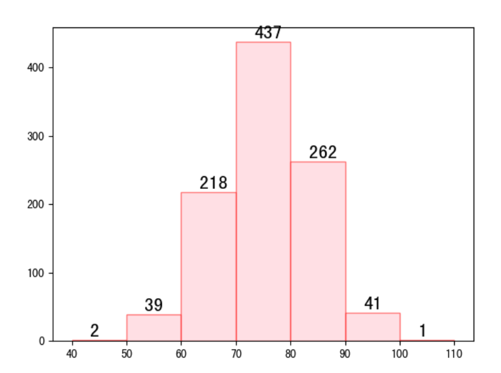{:width=300 height=300}
##### 箱型图
显示出一组数据的最大最小值、中位数、上下四分位数
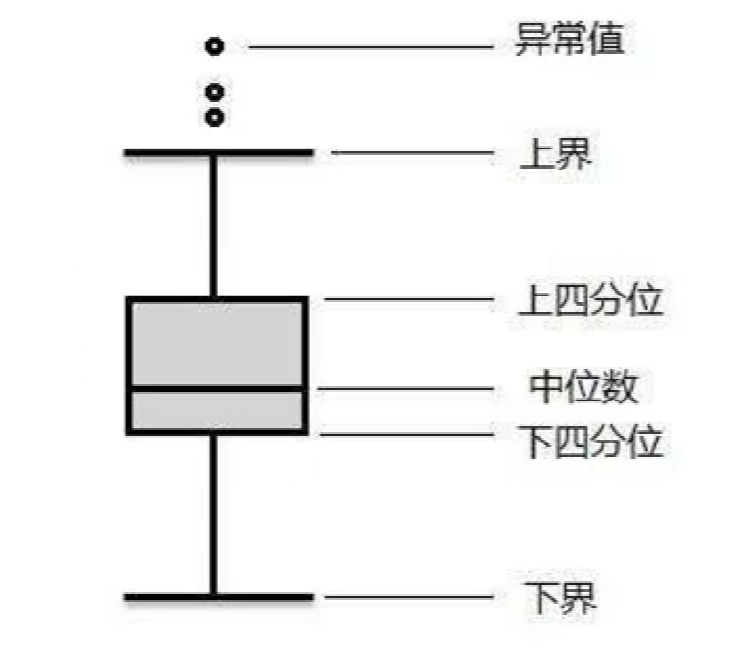{:width=300 height=300}
相关概念：
- 上四分位数又称Q~3~，表示数据从小到大的3/4位置
- 下四分位数又称Q~1~，表示数据从小到大的1/4位置
- 四分位距(IQR)：Q~3~-Q~1~
- 异常值：大于Q~3~+1.5\*IQR或小于Q~1~-1.5\*IQR的值
- 极端值：大于Q~3~+3\*IQR或小于Q~1~-3\*IQR的值

`plt.boxplot(x)`
```py
x = [-10, 1, 1, 2, 4, 5, 5, 6, 7, 10, 20, 30]
plt.boxplot(x)
plt.show()
```
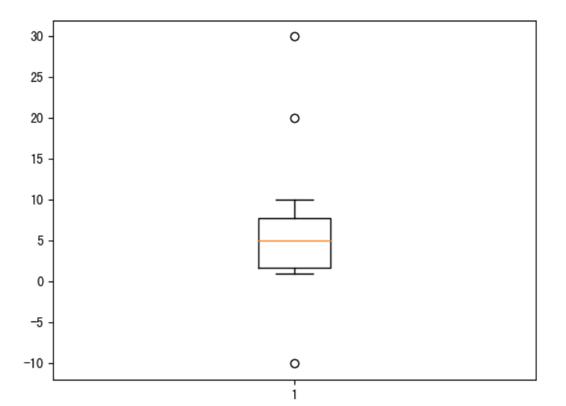{:width=300 height=300}

---

同时画多个箱型图：当`plt.boxplot(x)`中的x为一个二维数组时，每个元素（数组）都会画一个箱型图
```py
x1 = [-10, 1, 1, 2, 4, 5, 5, 6, 7, 10, 20, 30]
x2 = [0, 1, 1, 2, 4, 5, 5, 6, 7, 10]
x3 = [1, 2, 4, 5, 5, 6, 7, 10, 20]
plt.boxplot([x1, x2, x3])
plt.show()
```
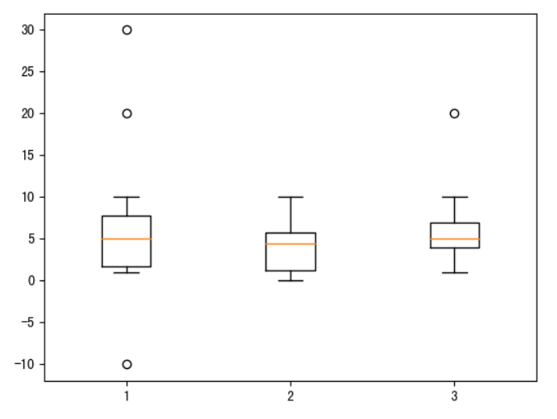{:width=300 height=300}
也可传入一个ndarray数组，每列画一个箱型图；还可以是一个df，每行画一个箱型图
```py
plt.boxplot(
    np.random.normal(size=(500, 4)),  # 数据，也可以写成：
    # pd.DataFrame(np.random.normal(size=(4, 500))),
    labels=list('ABCD'),  # 设定每个箱型图的名称
    notch=True,  # 画另一种箱型图--中位数位置凹陷
    sym='g*'  # 调整异常值样式--绿色、*状点
)
plt.show()
```
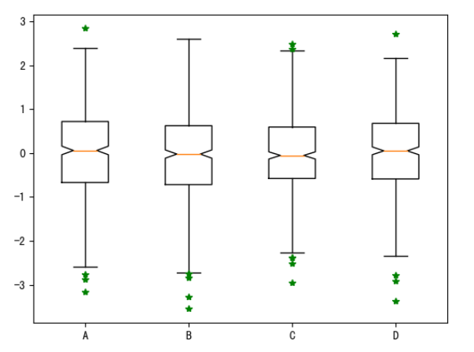{:width=300 height=300}
##### 散点图
可以表示因变量随自变量变化的趋势，一般用于反应一个变量受另一个变量的影响程度
`plt.scatter(x, y)`
```py
x = range(1, 7, 1)
y = range(10, 70, 10)
plt.scatter(x, y)
plt.show()
```
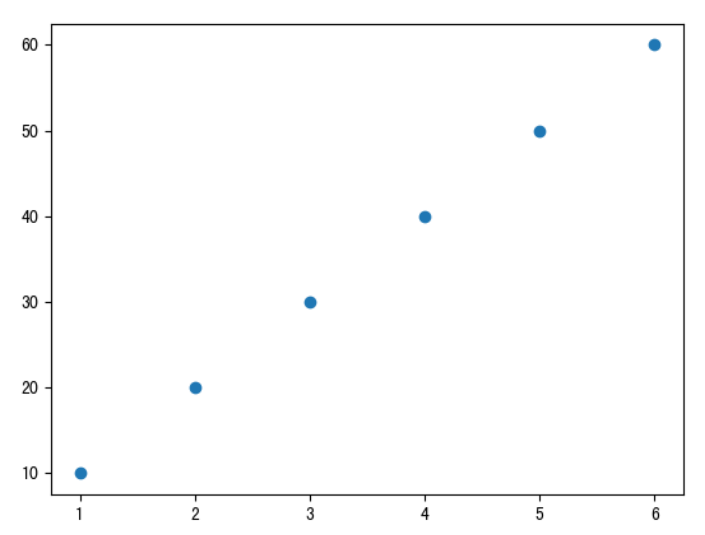{:width=300 height=300}
其它参数：
- 点的大小`s`，点大小由其它数据决定的散点图也可称为气泡图
- 颜色、透明度等参数同前

```py
data = np.random.randn(100, 2)  # 100行2列的符合正态分布的二维数组
x = data[:, 0]  # 第一列作x轴
y = data[:, 1]  # 第二列作y轴
plt.scatter(
    x, y,  # 数据
    s=np.random.randint(50, 200, size=100),  # 点大小为50-200间的随机值
    c=np.random.randint(0, 10, size=100),  # 点颜色随机
    alpha=0.6  # 透明度
)
plt.show()
```
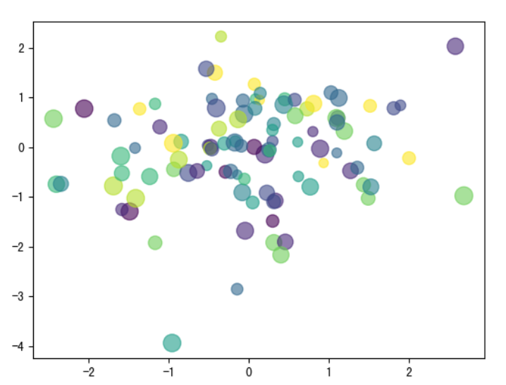{:width=300 height=300}

---

例：分析广告费用和销售收入间的关系
```
     月份   广告费用 销售收入
0   2014-01  24539  98984
1   2014-02  23760  88981
2   2014-03   3107  13898
3   2014-04  20950  71086
4   2014-05   7659  25936
```
```py
data = pd.read_excel('data/plt/plot.xlsx', sheet_name='scatter')  # 读取数据
x, y = data.广告费用, data.销售收入  # x轴--广告费用  y轴--销售收入
plt.scatter(x, y)
plt.title("广告费用和销售收入间的关系")  # 标题
plt.xlabel("广告费用")  # x轴标签
plt.ylabel("销售收入")  # y轴标签
plt.show()
```
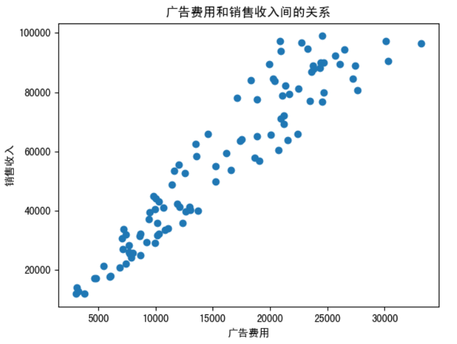{:width=300 height=300}

---

六边形图：每个坐标点和数据点均为六边形的散点图
```py
data = pd.read_excel('data/plt/plot.xlsx', sheet_name='scatter')  # 读取数据
plt.hexbin(
    data.广告费用, data.销售收入,  # 数据
    gridsize=20,  # 点大小
    cmap='rainbow'  # 调整色板颜色
)
plt.show()
```
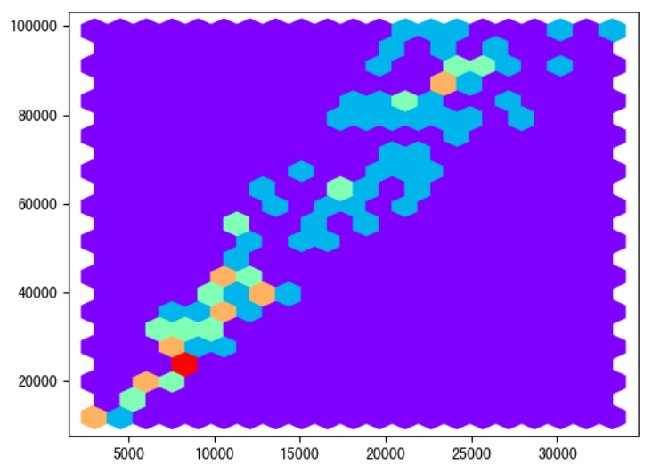{:width=300 height=300}
##### 饼图
显示一个数据系列中各项目占总和的百分比，项目种类数不能太多
`plt.pie(x, autopct)`x可以是一个数组，表示每个元素占数组总和的百分比，autopct设置自动标注每部分的占比
```py
x = [10, 20, 30, 40]
plt.pie(x, autopct='%.1f')  # 百分比保留到小数点后1位
plt.show()
```
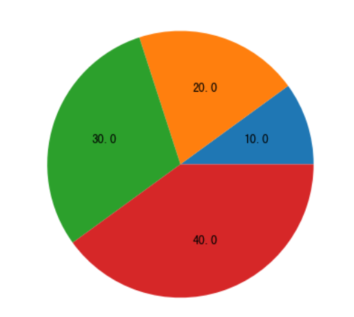{:width=300 height=300}
如果每部分的占比想要写成"20.0%"有百分号的形式：`autopct='%.1f%%'`，注意'.1f'后是两个百分号

---

例：
```
   省份   销量
0  广东  12932
1  山东   9622
2  湖北   9505
3  江苏   7898
4  浙江   7675
```
```py
data = pd.read_excel('data/plt/plot.xlsx', sheet_name='pie1')  # 读取数据
city, values = data.省份, data.销量
plt.pie(
    x=values,  # 数据
    autopct='%.1f%%',  # 百分比保留到小数点后1位，有百分号
    pctdistance=0.8,  # 调整百分比文字距圆心的距离
    labels=city,  # 为每个扇形设置标签，标识每部分都是什么数据
    labeldistance=1.2,  # 标签距圆心的距离
    shadow=True,  # 为图增添阴影效果
    textprops={  # 文字相关属性
        'fontsize': 12,  # 尺寸
        'color': 'blue'  # 颜色
    },
    # explode设置每个扇形与圆心的距离（是否让扇形脱离大圆）
    explode=[0.1 if i == '广东' else 0 for i in city],  # 让'广东'的扇形突出0.1距离，其它突出距离设为0（不突出）
)
plt.show()
```
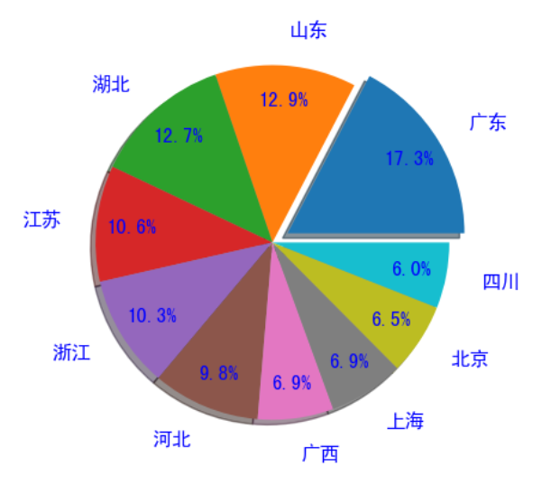{:width=300 height=300}
各部分含义：
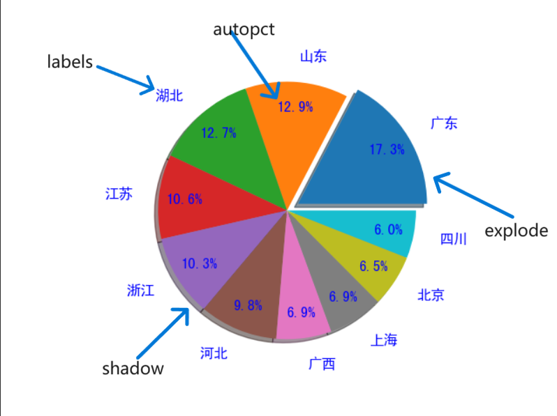{:width=300 height=300}

---

`wedgeprops`参数：
- `edgecolor`每个扇形的边缘颜色
- `width`扇形半径，当设置值<1时，可以画出空心的圆环状饼图

```py
x = [10, 20, 30, 40]
plt.pie(
    x=x,  # 数据
    autopct='%.1f%%',  # 百分比保留到小数点后1位，有百分号
    pctdistance=0.8,  # 调整百分比文字距圆心的距离
    wedgeprops={
        'width': 0.4,  # 该值越大，中间空心圆环越小
        'edgecolor': 'white'  # 扇形边缘为白色
    }
)
plt.show()
```
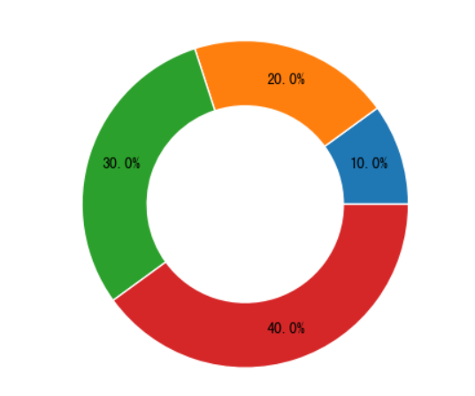{:width=300 height=300}

---

**画多个圆环**：比如现在有两组数据，它们的索引相同，但值不同，想要在一个图中同时体现一个索引对应的两个值
```
   省份   销量
0  广东  12932
1  山东   9622
2  湖北   9505
3  江苏   7898
4  浙江   7675
```
```
   省份   销量
0  广东  21600
1  山东   7800
2  湖北   9505
3  江苏   7898
4  浙江  12240
```
思路：在画出第一个圆环状饼图的基础上，修改第二个饼图的半径`radius`，使其放在第一个饼图的空心区域内
```py
fig = plt.figure(figsize=(8, 8))  # 调整画布大小
data1 = pd.read_excel('data/plt/plot.xlsx', sheet_name='pie1')  # 读取数据
data2 = pd.read_excel('data/plt/plot.xlsx', sheet_name='pie2')  # 读取数据
city1, values1 = data1.省份, data1.销量
city2, values2 = data2.省份, data2.销量
plt.pie(
    x=values1,  # 数据
    autopct='%.1f%%',  # 百分比保留到小数点后1位，有百分号
    pctdistance=0.8,  # 调整百分比文字距圆心的距离
    labels=city1,  # 扇形名称
    wedgeprops={
        'width': 0.4,  # 空心区域半径为1-0.4=0.6
        'edgecolor': 'white'  # 扇形边缘为白色
    }
)
plt.pie(
    x=values2,  # 数据
    autopct='%.1f%%',  # 百分比保留到小数点后1位，有百分号
    pctdistance=0.8,  # 调整百分比文字距圆心的距离
    radius=0.5,  # 半径应小于0.6
    wedgeprops={
        'width': 0.3,
        'edgecolor': 'white'  # 扇形边缘为白色
    },
    textprops={
        'fontsize': 8
    }
)
plt.legend(city1, fontsize=8)  # 创建图例
plt.show()
```
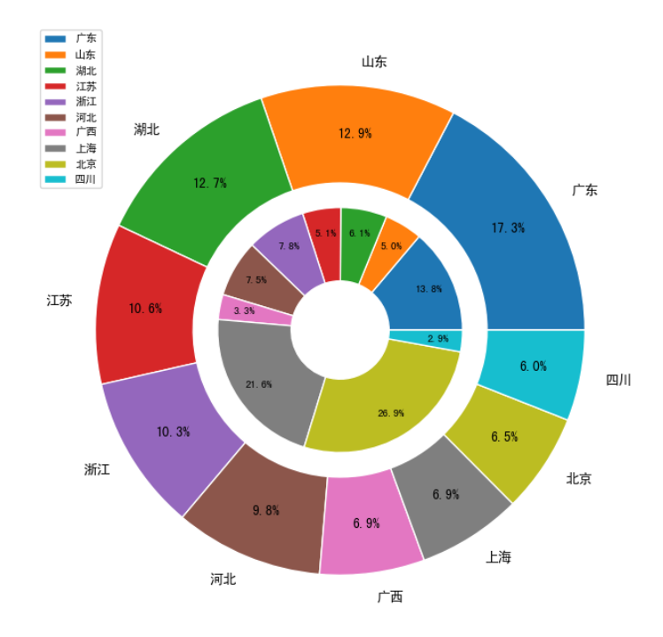{:width=500 height=500}
##### 面积图
可以理解成填充了的折线图
`plt.stackplot(x, y)`
```py
x = range(5)
y = np.random.randint(10, 100, 5)
plt.stackplot(x, y)
plt.show()
```
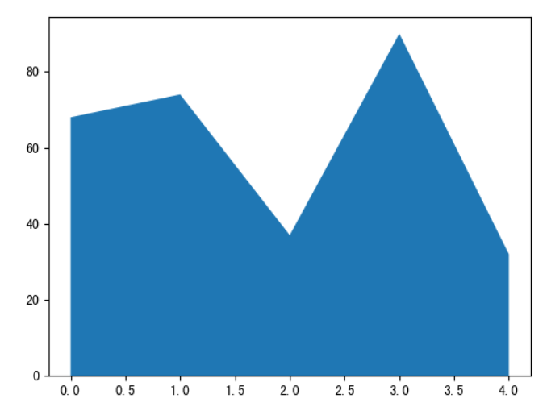{:width=300 height=300}

---

例：将面积图和折线图一起画（相当于给面积图描边）
```
   年份   销售额
0  2014  1962035
1  2015  2838693
2  2016  2317447
3  2017  2335002
4  2018  2438570
```
```py
data = pd.read_excel('data/plt/plot.xlsx', sheet_name='stackplot1')  # 读取数据
x, y = data.年份, data.销售额
plt.stackplot(x, y)
plt.plot(x, y, marker='o', linewidth=3)  # 增大线宽度
plt.show()
```
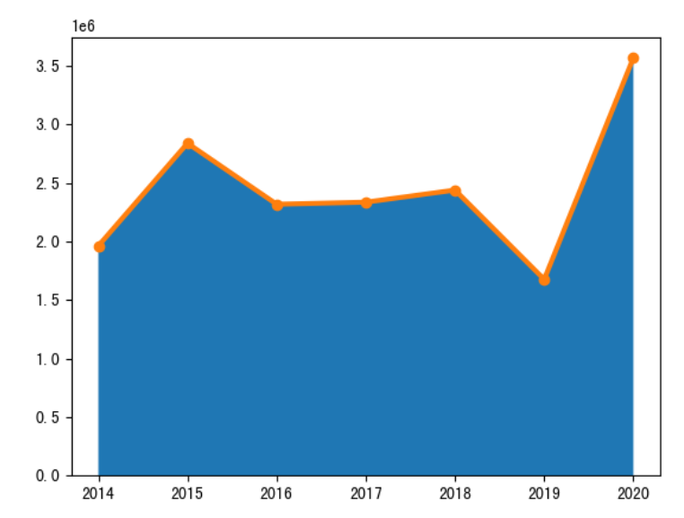{:width=300 height=300}
##### 热力图
是一种通过对色块着色来显示数据的图表，需指定颜色映射的规则（默认情况下，数值越大颜色越深）
`plt.imshow(data)`data应为一个二维数组/df，其中第m行n列的值即对应图中第m行n列的颜色
```
   省份  产品A 产品B  产品C 产品D 产品E  产品F 产品G
0  广东  9275  8498  5019  4468  3637  5997  8307
1  广西  9849  8413  9222  6162  3401  4045  1983
2  湖南  5413  7855  2973  1597  1078  4316  6213
3  湖北  7425  9862  3341  7923  4348  3878  3065
4  江西  1159  1334  1927  9884  8205  5933  6321
```
```py
fig = plt.figure(figsize=(12, 6))  # 调整画布大小
df = pd.read_excel('data/plt/plot.xlsx', sheet_name='imshow')  # 读取数据
y = df.省份  # 省份作y轴
x = df.drop(columns='省份').columns  # 除去省份的其它列的列名作x轴
data = df.drop(columns='省份').values  # 除去省份的其它列的数据作绘图数据
plt.imshow(data, cmap='Blues')  # 调整色板颜色
plt.xticks(range(len(x)), labels=x)  # 修改x轴刻度
plt.yticks(range(len(y)), labels=y)  # 修改y轴刻度
plt.show()
```
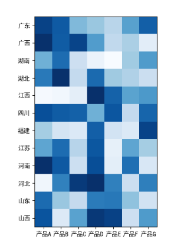{:width=400 height=400}
还可以为每个色块添加具体数据值显示
```py
fig = plt.figure(figsize=(12, 6))  # 调整画布大小
df = pd.read_excel('data/plt/plot.xlsx', sheet_name='imshow')  # 读取数据
y = df.省份  # 省份作y轴
x = df.drop(columns='省份').columns  # 除去省份的其它列的列名作x轴
data = df.drop(columns='省份').values  # 除去省份的其它列的数据作绘图数据
plt.imshow(data, cmap='Blues')  # 调整色板颜色
plt.xticks(range(len(x)), labels=x)  # 修改x轴刻度
plt.yticks(range(len(y)), labels=y)  # 修改y轴刻度
for row in range(data.shape[0]):  # data的第几行
    for col in range(data.shape[1]):  # data的第几列
        plt.text(  # 添加文本
            x=col,  # x轴坐标
            y=row,  # y轴坐标
            s=data[row][col],  # 数据值
            ha='center',
            va='center',  # 水平/垂直方向居中
            fontsize=10  # 尺寸
        )
plt.colorbar()  # 颜色条--类似于图例，标识颜色深浅对应的数值大小
plt.show()
```
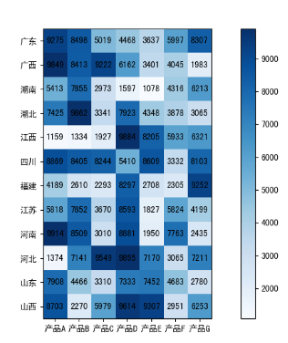{:width=400 height=400}
##### 极坐标图
可以理解成使用极坐标系画的柱状图
```py
x = np.linspace(0, 2*np.pi, 想分成的份数, endpoint=False)
axes = plt.subplot(111, projection='polar')  # 创建一个使用极坐标系的图对象
axes.bar(x, y)  # 画系坐标系下的柱状图，即极坐标图
```
例：
```py
n = 8  # 画出的极坐标图有8份
x = np.linspace(0, 2*np.pi, n, endpoint=False)  # 0-2pai间取8份
height = np.random.randint(3, 15, size=n)  # 生成8个3-15间整数作每部分的大小
axes = plt.subplot(111, projection='polar')
axes.bar(
    x, height,
    width=2*np.pi/n,  # 宽度为2pai/8（该参数可不设定）
    bottom=0,  # 从0开始画
    color=np.random.rand(n, 4)  # 每个扇形颜色不同
)
plt.show()
```
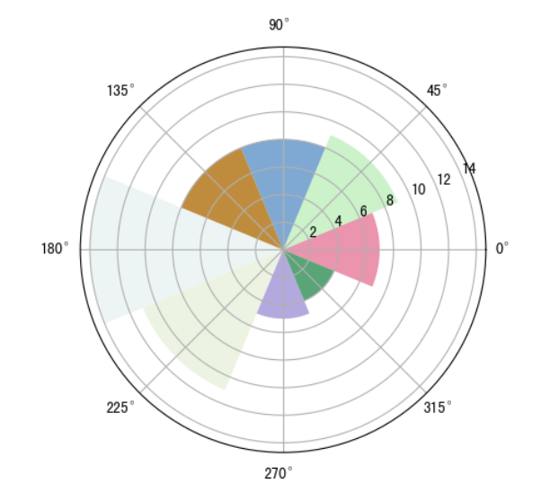{:width=300 height=300}
扩展：使用二维数组给`color`参数赋值--数组每行的数据被传入`rgba()`颜色生成函数中，数组的一行对应着一种颜色。因为`rgba()`需要3或4个参数（第4个参数为透明度），所以该二维数组需要3或4列，如上面的`np.random.rand(n, 4)`也可以写成`np.random.rand(n, 3)`
##### 雷达图
与[极坐标图](#极坐标图)类似，它是极坐标系与折线图的结合
```py
n = 6  # 画出的雷达图有6个点
x = np.linspace(0, 2*np.pi, n, endpoint=False)  # 0-2pai间取6份
y = [80, 60, 20, 100, 50, 60]
axes = plt.subplot(111, polar=True)
axes.plot(x, y)
plt.show()
```
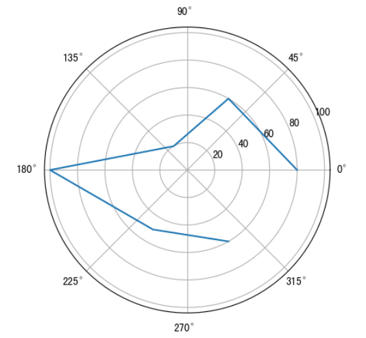{:width=300 height=300}
可以看到虽然6个点都画出来了，但是首尾未闭合，不好看。改进方法：把x/y数据的第一个元素复制添加在结尾
```py
n = 6  # 画出的雷达图有6个点
x = np.linspace(0, 2*np.pi, n, endpoint=False)  # 0-2pai间取6份
y = [80, 60, 20, 100, 50, 60]
x = np.concatenate((x, [x[0]]))
y = np.concatenate((y, [y[0]]))
axes = plt.subplot(111, polar=True)
axes.plot(x, y)
plt.show()
```
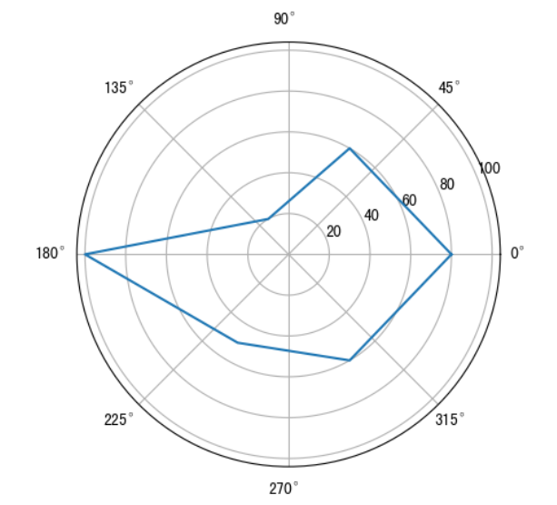{:width=300 height=300}
因为雷达图本质是折线图，所以它的颜色和点线样式都与折线图相同
填充颜色：`axes.fill(x, y)`
```py
n = 6  # 画出的雷达图有6个点
x = np.linspace(0, 2*np.pi, n, endpoint=False)  # 0-2pai间取6份
y = [80, 60, 20, 100, 50, 60]
x = np.concatenate((x, [x[0]]))
y = np.concatenate((y, [y[0]]))
axes = plt.subplot(111, polar=True)
axes.plot(x, y, 'o-', lw=2)
axes.fill(x, y, color='r', alpha=0.5)
axes.set_rgrids(range(20, 120, 20), fontsize=12)  # 显示刻度，注意使用的函数不同
plt.show()
```
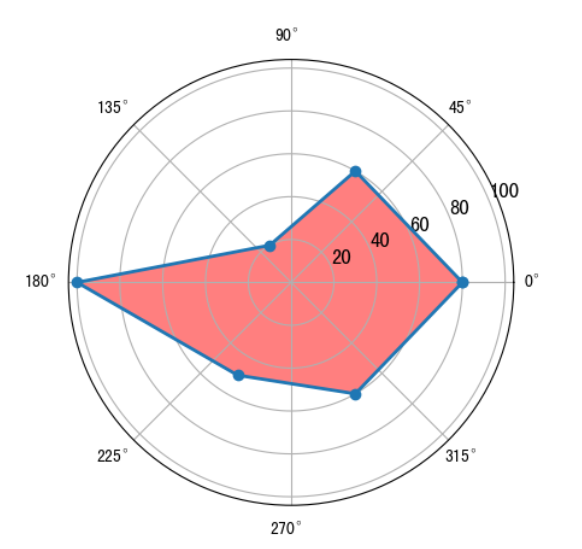{:width=300 height=300}
##### 等高线图
也称水平图，是一种在二维平面上显示3D图像的方法
###### 网格数据
先介绍一个函数：`np.meshgrid(x, y)`它返回两个二维数组（网格数据）。设xy最大长度为`len`：
- 第一个返回值：将x的元素作为一行，复制该行`len`次
- 第二个返回值：将y的元素作为一列，复制该列`len`次

```py
x = np.array([1, 2, 3])
y = np.array([4, 5, 6, 7])
print(np.meshgrid(x, y))
```
```
array([[1, 2, 3],
       [1, 2, 3],
       [1, 2, 3],
       [1, 2, 3]])
array([[4, 4, 4],
       [5, 5, 5],
       [6, 6, 6],
       [7, 7, 7]])
```
现在我们要使用的数据：
```py
x = np.linspace(-5, 5, 100)
y = np.linspace(-5, 5, 100)
x, y = np.meshgrid(x, y)
```
```
[[-5.        -4.8989899 -4.7979798 ...  4.7979798  4.8989899  5.       ]
 [-5.        -4.8989899 -4.7979798 ...  4.7979798  4.8989899  5.       ]
 [-5.        -4.8989899 -4.7979798 ...  4.7979798  4.8989899  5.       ]
 ...
 [-5.        -4.8989899 -4.7979798 ...  4.7979798  4.8989899  5.       ]
 [-5.        -4.8989899 -4.7979798 ...  4.7979798  4.8989899  5.       ]
 [-5.        -4.8989899 -4.7979798 ...  4.7979798  4.8989899  5.       ]]
[[-5.        -5.        -5.        ... -5.        -5.        -5.       ]
 [-4.8989899 -4.8989899 -4.8989899 ... -4.8989899 -4.8989899 -4.8989899]
 [-4.7979798 -4.7979798 -4.7979798 ... -4.7979798 -4.7979798 -4.7979798]
 ...
 [ 4.7979798  4.7979798  4.7979798 ...  4.7979798  4.7979798  4.7979798]
 [ 4.8989899  4.8989899  4.8989899 ...  4.8989899  4.8989899  4.8989899]
 [ 5.         5.         5.        ...  5.         5.         5.       ]]
```
###### 等高线图
`plt.contourf(X, Y, Z)`X/Y为网格数据、Z为点高度
可以理解成：XYZ中相同位置的元素组成点坐标(x, y, z)
```py
x = np.linspace(-5, 5, 100)
y = np.linspace(-5, 5, 100)
x, y = np.meshgrid(x, y)
z = np.sqrt(x**2+y**2)  # xy坐标平方和，开根号，结果图应为一个圆
plt.figure(figsize=(6, 5))  # 调整画布大小
cb = plt.contourf(x, y, z)  # 画图
plt.colorbar(cb)  # 添加颜色条
plt.show()
```
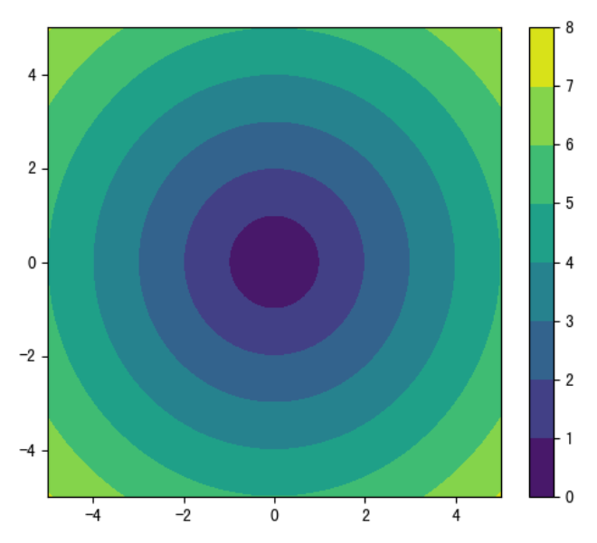{:width=300 height=300}
可以看到越靠近中心，距圆心距离（高度）越小，颜色越深
##### 3D图
旧版本：
```py
from mpl_toolkits.mplot3d.axes3d import Axes3D  # 先引入包
fig = plt.figure()  # 创建画布对象
axes = Axes3D(fig, auto_add_to_figure=False)  # 设置坐标轴手动添加到fig中
fig.add_axes(axes)  # 将坐标轴添加到fig中
axes.画图函数  # 与二维的画图函数相同
```
新版本：
```py
from mpl_toolkits.mplot3d.axes3d import Axes3D
fig = plt.figure()  # 创建画布对象
axes = Axes3D(fig)  # 创建坐标轴
axes.画图函数  # 与二维的画图函数相同
```
###### 三维折线图
使用plot画图函数：
```py
from mpl_toolkits.mplot3d.axes3d import Axes3D
fig = plt.figure(figsize=(5, 5))  # 创建画布对象
x = np.linspace(0, 100, 400)
y = np.sin(x)
z = np.cos(x)
axes = Axes3D(fig)  # 创建坐标轴
axes.plot(x, y, z)
plt.show()
```
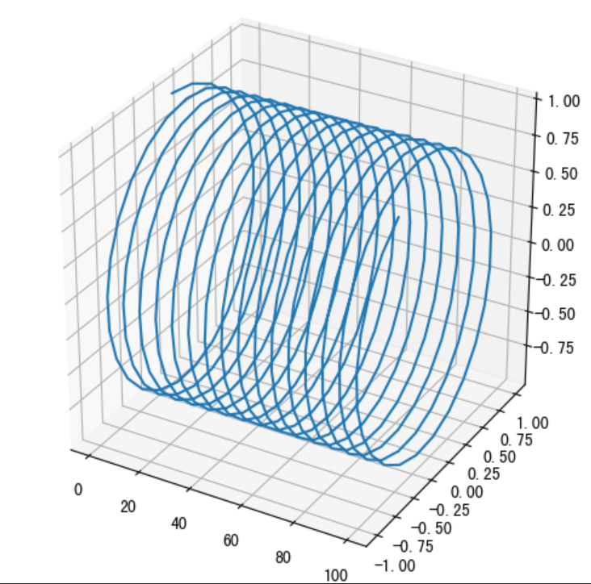{:width=300 height=300}
###### 三维散点图
使用scatter画图函数：
```py
from mpl_toolkits.mplot3d.axes3d import Axes3D
fig = plt.figure(figsize=(5, 5))  # 创建画布对象
x = np.random.rand(50)
y = np.random.rand(50)
z = np.random.rand(50)
axes = Axes3D(fig)  # 创建坐标轴
axes.scatter(x, y, z, color='r')
plt.show()
```
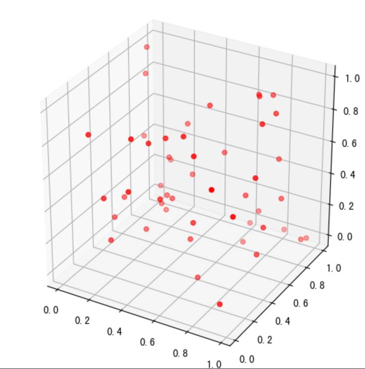{:width=300 height=300}
###### 三维柱形图
使用bar画图函数，不过画图的过程不同，不能简单的将xyz传入函数中
思路：在x=1/2/3/4的位置各画一个柱形图，每个柱形图都在yz平面上
```py
from mpl_toolkits.mplot3d.axes3d import Axes3D
fig = plt.figure(figsize=(7, 7))  # 创建画布对象
axes = Axes3D(fig)  # 创建坐标轴
x_data = [1, 2, 3, 4]
for x in x_data:
    axes.bar(  # yz上面的每个柱状图
        [10, 20, 30],  # y轴坐标
        np.random.randint(10, 100, 3),  # z轴坐标（高度）
        zs=x,  # 在x轴上的位置
        zdir='x',  # 在x轴方向上排列
        width=6,
        alpha=0.7
    )
axes.set_xlabel('X轴', color='r', fontsize=16)
axes.set_ylabel('Y轴', color='g', fontsize=16)
axes.set_zlabel('Z轴', color='b', fontsize=16)
plt.show()
```
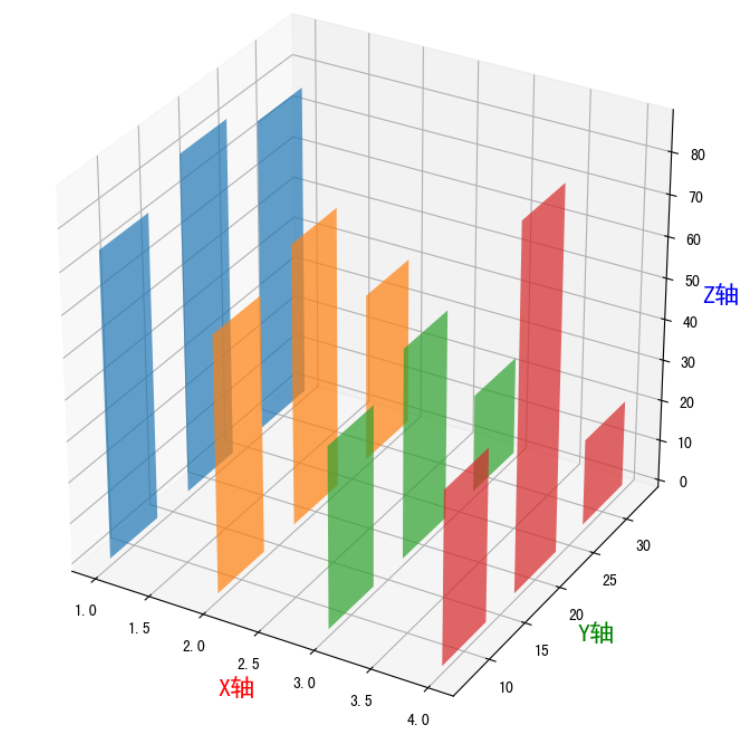{:width=300 height=300}
### 对已有图进行处理
**读取图片**：`图对象=plt.imread(路径)`
```py
img = plt.imread('data/plt/pandas.jpeg')  # 可能需要安装pillow包才能读取JPEG文件
print(img.shape)  # (583, 1024, 3)
print(img)
```
```
[[[ 78  20  79]
  [ 78  20  79]
  [ 78  20  79]
  ...
  [ 52  55 124]
  [ 52  55 124]
  [ 52  55 124]]]
```
可以看到`img`是一个三维数组，`shape`返回值中前两个值分别为图片的高（竖直方向长度）/宽（水平方向长度），第三个值表示图片每个像素点由三个整数表示（rgb颜色表示法），有些黑白图的像素点可由两个整数表示

---

**显示图片**：`plt.imshow(图对象)`
```py
img = plt.imread('data/plt/pandas.jpeg')
plt.imshow(img)  # 相当于把图画到了画布上
plt.show()  # 展示图片
```
{:width=300 height=300}

---

**更改图片**：
- 垂直/上下翻转：`plt.imshow(img, origin='lower')`或`plt.imshow(img[::-1])`
    ```py
    img = plt.imread('data/plt/pandas.jpeg')
    plt.imshow(img, origin='lower')
    plt.show()
    ```
    {:width=300 height=300}
    ```py
    img = plt.imread('data/plt/pandas.jpeg')
    plt.imshow(img[::-1])
    plt.show()
    ```
    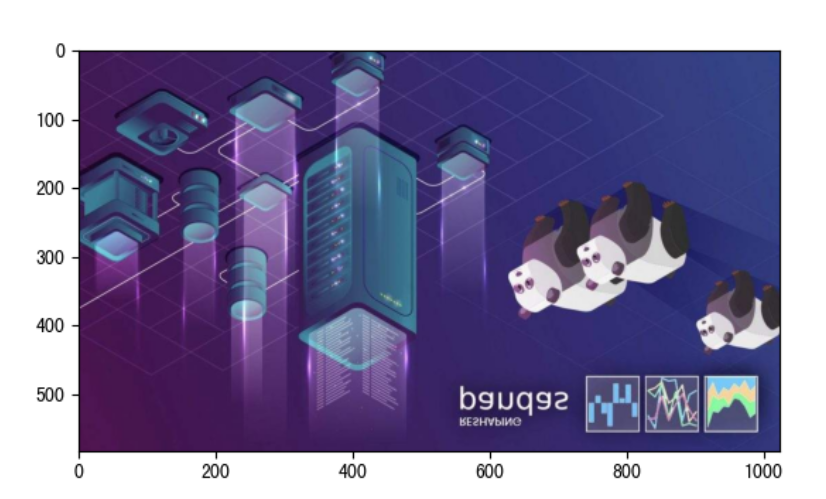{:width=300 height=300}
    两者的区别在于`origin='lower'`是改变坐标轴原点位置（翻转了y轴），而`[::-1]`直接改变图片数组
- 水平/左右翻转：`plt.imshow(img[:, ::-1])`
    ```py
    img = plt.imread('data/plt/pandas.jpeg')
    plt.imshow(img[:, ::-1])
    plt.show()
    ```
    {:width=300 height=300}
- 截取图片：坐标系参考上面图片的坐标轴
    ```py
    img = plt.imread('data/plt/pandas.jpeg')
    plt.imshow(img[100:500, 200:800])  # 截取纵轴100-500、横轴200-800的部分
    plt.show()
    ```
    {:width=300 height=300}

---

**保存图片**：`plt.imsave(路径, 图对象)`
```py
img = plt.imread('data/plt/pandas.jpeg')
new_img = img[100:500, 200:800]
plt.imsave('data/plt/new_pandas.png', new_img)
```
{:width=200 height=200}
### 综合案例
导入数据：
```py
df = pd.read_csv('data/plt/kobe.csv')
print(df.shape)  # (30697, 25)  共有30697行25列
print(df.head())
```
```
         action_type combined_shot_type  ...  opponent  shot_id
0          Jump Shot          Jump Shot  ...       POR        1
1          Jump Shot          Jump Shot  ...       POR        2
2          Jump Shot          Jump Shot  ...       POR        3
3          Jump Shot          Jump Shot  ...       POR        4
4  Driving Dunk Shot               Dunk  ...       POR        5
[5 rows x 25 columns]
```
本案例中使用的列含义说明：
- 投篮点坐标(`loc_x`, `loc_y`)
- 投篮经纬度(`lat`, `lon`)
- 进攻方式（更具体）`action_type`
- 进攻方式`combined_shot_type`
- 是否进球`shot_made_flag`
- 投篮区域（更具体）`shot_zone_basic`、 投篮范围`shot_zone_range`、投篮区域`shot_zone_area`
- `period`表示第几节

